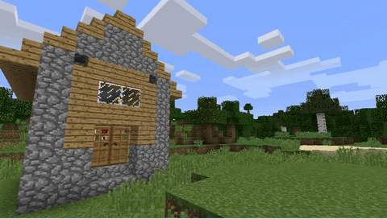
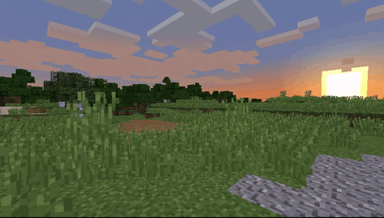
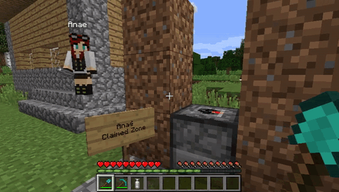
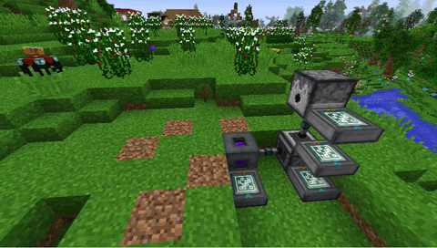

# Capsule Mod: 1.12.2 - Bring your base! Update

_Published on imgur on 2017-11-28 for Capsule 1.12.2 (also 1.11.2 and 1.10.2). Full list of changes in the
[changelog](https://github.com/Lythom/capsule/blob/1.21.1/CHANGELOG.md)._

---

Bring your base! Capsules can capture a region containing any blocks or machines, then deploy and undeploy at will.
Inspired by Dragon Ball capsules.

What's new in the "Bring your base" update:

- Griefing protection support
- Capsules can be used by non-players (i.e. dispensers, mechanical users)
- Updated for Minecraft 1.12.2 / 1.11.2 / 1.10.2
- And more fixes under the hood!

Downloads: https://www.curseforge.com/minecraft/mc-mods/capsule/files 
Wiki: https://github.com/Lythom/capsule/wiki 
Project page: https://www.curseforge.com/minecraft/mc-mods/capsule 
Discord: https://discord.gg/wZpBVdr

---

Going out? Take your home with you!

Chests, furnaces, modded machines will keep their state until you deploy them. Even multiblocks.

---

It's getting late, let's have a break here.

Beds won't keep the spawn position after being undeployed (exactly like when you break them), so you may want to
avoid beds or use some other mod to ensure your respawn position!

---

Includes griefing protection support.

Here the area is claimed using the FTBUtils claiming system: any protected block is ignored, whereas other blocks in
the wild are captured normally.
It should work with any protection system that prevents a player from taking or placing a block.

> Today (Capsule 9.1 for 1.21.1): see [Claim protection](Home#claim-protection) for the claim mods Capsule supports.

---

Players are no longer needed to use capsules :-O

This automation uses:

- A Mechanical User from Extra Utilities 2 to undeploy, then activate the capsule
- A cable from EnderIO to give it to a dispenser
- A dispenser to throw the activated capsule
- A Vacuum Chest from EnderIO to gather the deployed capsule
- Several Sequencers from RFTools to orchestrate the steps

Fun fact: when I put this whole system into a capsule to move it, something unexpected happened. During deployment,
the deployed capsule got sucked in by the system itself and got undeployed by the mechanical user.
To this day, the capsule is still contained in the mechanical user that is contained in the capsule itself, lost in
some unknown time-space universe.

(For those who actually need to retrieve the content after a similar loss, the "unknown time-space universe" is the
folder located at "/structures/capsule".)

> Today: since 1.16.5 the folder is `<world save>/capsules`, and a dispenser or a Capture Base deploys a capsule by
> itself on a redstone signal, see [Automation](Home#automation-with-dispensers).

---

Want to see more?
Check out the previous 1.10 major update: https://imgur.com/a/xCWCX 
And some old fun tricks (that still work!): https://imgur.com/a/gnkfR
