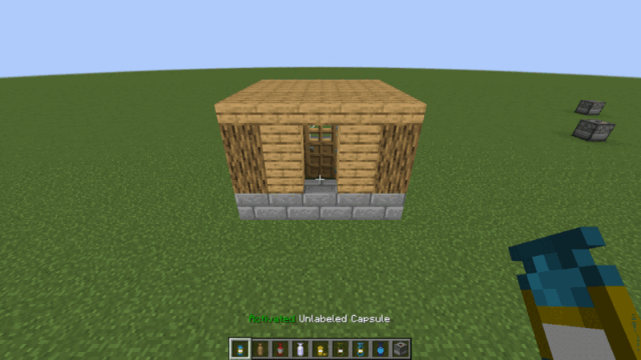
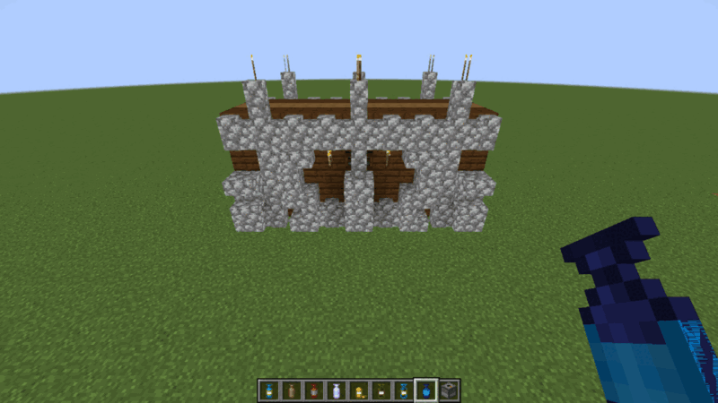
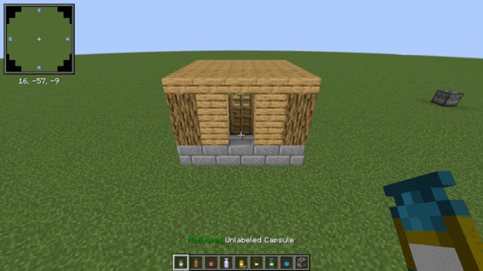

# Manual validation

What the historical test campaign (`TEST.md`) checks, what the automated layers now cover, and what a human must still
validate before a release. Automated layers (see `docs/TESTING.md`):

- **GT**: GameTests, both loaders (`./gradlew build`), names below; `GT-mods` are the NeoForge GameTests with third-party
  mods (`-PmodCompat`).
- **UT**: JUnit tests.
- **CS**: client smoke test (`scripts/client-smoke.sh neoforge|fabric`), screenshot names below; the screenshots are
  reviewed by a human, but their missing-texture, empty-slot and log checks are automatic.
- **PS**: production jar smoke test (`scripts/prod-smoke.sh`).

Last full run: 2026-10-05, NeoForge 21.1.255 and Fabric Loader 0.19.5 / Fabric API 0.116.17, both client smoke tests
green (24 checks on NeoForge, 22 on Fabric where JEI is not loaded). Both clients render the same; the Fabric
screenshots differ only by a slightly wider field of view.

## Visual review of the client smoke test

Every screenshot of both loaders was looked at. The screenshots below are NeoForge unless named otherwise.

| Screenshot | What it shows | Verdict |
|---|---|---|
|  `02-capture-base-with-empty-capsule` | a 5×5×5 house over a capture base and a second, empty capture base; both capture zones drawn as wireframes in the capsule's base color (light blue); the empty capsule held in the right hand | correct |
|  `01-capture-base`, `02-...` (zoom) | the empty capture base: normal top without capsule, activated (yellow) top with an empty capsule in hand | correct after the fix below |
|  `05-hotbar` | linked (light blue base, gold material, white label), wooden empty, red dyed iron, OP (lavender, enchantment glint), deployed (yellow, open sprite), one-use reward (green), recovery (striped one-use sprite), charged blueprint (blue overlay), capture base (3D block with the red marker on top) | correct: base tint, material tint and per-state sprites |
|  `07-inventory-blueprint-tooltip` | survival inventory: the 16 dye colors on iron capsules, copper/gold/diamond/obsidian/emerald capsules, uncharged blueprint, upgraded and recall-enchanted capsules; blueprint tooltip (size, instantaneous, controls); JEI item list on the right | correct; every capsule tooltip ends with a vanilla "Dyed" line (see findings) |
|  `09-jei-capsule-recipes` | JEI crafting recipes of the wooden capsule: shaped recipe, chorus upgrade, clear | correct (NeoForge; JEI is not loaded on Fabric) |
|  `11-deploy-preview` | activated linked capsule in hand, full preview of the captured house where it will deploy | correct; the preview is opaque (see #88) |
|  `13-capsule-thrown` | the thrown capsule in the air toward the previewed position | correct |
|  `15-deployed-capsule-in-hand` | the deployed house, rotated 90° as previewed after a left click, with the recall box of the deployed capsule held in hand | correct |
|  `17-blueprint-preview` | charged castle wall blueprint, its full preview including cobblestone walls and dark oak fences | correct after the fix below |
|  `18-blueprint-deployed` (Fabric) | the deployed castle wall and the recall box of the now uncharged blueprint | correct |
|  `11-deploy-preview` with the Create: OneBlock pack | the same preview with the 38 mods of the pack loaded (Create, Sodium, Xaero's Minimap...) | correct |

Other screenshots of the run, not copied here: capture base alone, capture particles and the linked capsule on the
ground, linked capsule tooltip, creative search "capsule" (every capsule of the creative tab), third person view
holding a capsule, rotated preview, undeploy particles.

Findings, fixed on this branch:

- Every capture base showed its activated top until an empty capsule had been held once (regression of 077c784, which
  made capture bases keep the dispenser default `triggered=false`, the state the highlight used). Fixed in 4c1e887.
- Capsules were held edge-on (a thin stripe in first person, a stick in third person): the item models carried
  Minecraft 1.8 hand transforms. Fixed in 0c63f8a.
- NeoForge full previews dropped every multipart block (walls, fences, panes, redstone, modded multipart blocks): the
  castle wall preview showed torches floating above missing walls. Fixed in dbc35e5.
- Taking a blueprint in hand right after a linked capsule showed the linked capsule's content as the blueprint preview
  (Fabric; possible on NeoForge with a real slot change): the server answered with the template of the item it still saw
  in hand. Fixed in b7b10b5, test `previewAnswersTheAskedCapsule`.

Findings left as they are (BACKLOG):

- The full preview is opaque and hides what is behind it (#88).
- A capture base powered by redstone shows its activated top: the highlight is the dispenser `triggered` property,
  set by redstone on the server and by the held item on the client.
- Capsule tooltips end with the vanilla "Dyed" line, because the base color is a `dyed_color` component shown in
  tooltips.
- With Sodium (Create: OneBlock run), blocks set by the harness in chunk (0, 0) right after the world loaded were not
  drawn until the chunk changed again; capsule deploys were drawn normally. A harness/Sodium artifact, not a capsule
  issue.

## Third-party mods

| Mods (versions) | How | Result |
|---|---|---|
| SecurityCraft 1.10.2.1 | GT (NeoForge dev runs, always): `othersCannotCaptureSecurityCraftBlocks`, `onlyOwnersPassTheSecurityCraftOwnerCheck` | pass |
| Waystones 21.1.46 + Balm 21.0.66 (#121) | GT-mods: `waystoneStaysWhenCapturedWithADoor`, `...ByAnOverpoweredCapsule` | pass: Waystones tags its blocks `c:relocation_not_supported`, so standard and OP capsules leave both halves in place with their block entity; the door next to it is captured, deployed and undeployed with both halves, no ghost block |
| Sophisticated Storage 1.6.1 + Sophisticated Core 1.5.5 (#115) | GT-mods: `rewardBarrelsDoNotShareTheirContent` | pass; fails without the #115 fix (4c18fbc): "emptying the first barrel emptied the second one: 0 diamonds" |
| JEI 19.57.0.451, SecurityCraft, Waystones, Balm, Sophisticated Storage, Sophisticated Core | PS with `EXTRA_MODS`, release jar on a NeoForge 21.1.255 dedicated server | boots, `capsule` command registered, no error in the log, clean stop |
| JEI 19.57.0.451 | CS NeoForge | capsule plugin loaded: 3 crafting recipes for the wooden capsule, 14 capsule information pages |
| Create: OneBlock 1.3 (Modrinth, 40 mods: Create 6.0.10, Sodium 0.6.13, Sodium Extra, Lithium, ModernFix, FerriteCore, Farmer's Delight, Carry On, Jade, Xaero's Minimap, Sophisticated Backpacks, Curios, Architectury, Forgified Fabric API...) | CS NeoForge with `EXTRA_MODS`, without Sinytra Connector and Trinkets (Connector cannot start in a dev run: "Could not determine clean minecraft artifact path"; Trinkets is a Fabric mod it would load) | full scenario passes, no capsule problem in the log |

## Coverage of TEST.md

"Manual" means a human must check it; the reason is given when it is not obvious.

### Items

| TEST.md item | Covered by | Manual |
|---|---|---|
| Empty capsule recipes (all materials, OP) visible in creative tab and JEI | GT `everyCapsuleRecipeLoadsWithResolvedIngredients`, `ironCapsuleRecipe`; CS `08-creative-search`, `09-jei-capsule-recipes` | JEI on Fabric |
| JEI information tabs (empty, linked, deployed, recovery, blueprint, OP, capture base) | CS JEI check (14 capsule information pages) | reading the texts |
| Tooltips (empty, linked, deployed, recovery, blueprint) | CS `06-inventory-linked-tooltip`, `07-inventory-blueprint-tooltip` | other states' texts |
| Dye (empty, linked, deployed, recovery, blueprint) | GT `dyeRecipeColorsCapsule` (empty); CS sprites of dyed capsules | dyeing each other state in a crafting grid |
| Upgrade with chorus fruit, upgrade limit config (0, 1, 24), not on linked/deployed/recovery/blueprint | GT `upgradeRecipeGrowsCapsule` | limits 0/1/24 and refusals |
| Upgrade item changed by an asset/data pack, JEI updated | | yes |
| Clear recipe (linked → one-use given back, deployed → empty), not on recovery/blueprint | GT `clearRecipeEmptiesCapsule` | deployed and refusals |
| Recovery recipe, recovery deploy empties the source | GT `recoveryRecipeMakesOneUseCopy`, `recoveryCapsuleEmptiesSourceTemplate` | |
| Recall enchantment (allowed states, enchanting table) | GT `recallIsOfferedByEnchantingTables`, `recallLetsAnEarlyCollidingCapsuleDeploy` | enchanting each state in an anvil |
| Relabel with sneak + right click (label GUI) | | yes (GUI and keyboard) |
| Preview rotation (90/180/270) with left click | CS `11` → `12-deploy-preview-rotated` (one rotation); UT `rotationKeepsContentInsideTheCapsuleCube` | the four steps and the feel of the controls |
| Mirror with sneak + left click (FRONT_BACK, LEFT_RIGHT, none) | UT `mirrorFlipsOneAxis` | in game |
| Deployed capsule right click undeploys | GT `undeployDeployedCapsule`; CS `15` → `16-undeployed` | |
| One-use / reward deploys and is consumed | GT `rewardCapsuleDeploysTwice`, `recoveryCapsuleEmptiesSourceTemplate` | throwing a recovery capsule in game |
| Blueprint recipes (from linked, blueprint, one-use, reward), change recipes | GT `blueprintRecipeCopiesCapsule` | the change recipe variants |
| Blueprint recharge from player inventory, from a linked inventory, from both; materials consumed | GT `blueprintConsumesMaterials` (player inventory), `pottedPlantsAreNotFree` | linked inventory (sneak + right click) and its highlight; Fabric modded storages (Transfer API) |
| Blueprint world recharge (structure must match, dispenser content) | | yes |
| Blueprint whitelist (excluded chest message, note block pitch kept) | | yes |
| Prefab blueprint recipes generated from `config/capsule/prefabs` | GT `everyBundledTemplateDeploys` (prefabs deploy); CS blueprint from the castle wall prefab | custom prefabs and their JEI recipes after a restart |

### Blocks, preview, translations

| TEST.md item | Covered by | Manual |
|---|---|---|
| Capture base in creative tab and JEI, recipe | CS `08-creative-search`, `05-hotbar`; GT `everyCapsuleRecipeLoadsWithResolvedIngredients` | |
| Capture base 3D model in world and in hand | CS `01-capture-base`, `04-captured`, `05-hotbar` | in hand (third person) |
| Capture base highlighted with a wireframe when an empty capsule is held | CS `01-capture-base`, `02-capture-base-with-empty-capsule` (wireframe and activated top) | |
| Wireframe preview of a line and a column | | yes (the full preview is shown instead when the template is received; the wireframe shows for size 1 capsules and big templates) |
| Translations (English, French) | | yes |

### Commands

| TEST.md item | Covered by | Manual |
|---|---|---|
| `giveEmpty` sizes and `overpowered` | PS (`help capsule` lists the commands) | yes |
| `giveLinked`, `giveBlueprint`, `exportHeldItem`, `exportSeenBlock`, `fromHeldCapsule`, `fromStructure`, `fromExistingReward` | CS creates a blueprint the way `giveBlueprint` does | yes |
| `giveRandomLoot` with `allowBlueprintReward` | GT `defaultLootTablesHoldTheCapsulePool`, `capsuleLootEntryRoundTrips` | the config switch |
| `reloadLootList`, `setBaseColor`, `setMaterialColor`, `setAuthor` | GT `reloadRefreshesRewardTemplates` (reload) | yes |

### Features

| TEST.md item | Covered by | Manual |
|---|---|---|
| Starters (`starterMode` all/random/none, given once per player) | | yes (needs new players and relogs) |
| Instant capsules (size 1): capture without capture base, deploy without throw | GT `instantCaptureWorksAtPreviewRange`, `instantCapsuleCannotUndeployInstantly`, `instantCapsuleUndeploysAfterRelog` | |
| Overridable blocks (grass replaced, grown grass captured, not deployed over stone) | GT `overridableBlocksAreReplaced`, `solidBlocksPreventDeploy`, `deployReplacesTheAimedSnowLayer` | grown grass round trip |
| Transdimensional deploy and throw through a portal, with recall | | yes |
| Underwater deploy and throw on water | | yes |
| Dispenser throws an activated capsule | GT `freshCaptureBaseDispensesOnFirstSignal` | the vertical dispenser with a button |
| Initial capture over a capture base (thrown empty capsule) | GT `thrownCapsuleCapturesAboveCaptureBase`; CS `02` → `04-captured` | |
| Excluded blocks (end portal frame, bedrock; OP capsule) | GT `excludedBlocksStayInPlace`, `configuredTagsExcludeBlocksFromCapture`; UT `tagsAreReadWithOrWithoutHash` | OP capsule with the end portal frame |
| Dynamic prefab recipes | | yes |
| Loot in desert pyramids, not in dungeons with a custom config | GT `defaultLootTablesHoldTheCapsulePool` | the custom config |
| Minecart with content undeployed/deployed drops nothing | | yes |

## Must be validated by a human

- Multiplayer on a real server with latency: throw and preview synchronisation, previews of other players' capsules,
  the label GUI.
- Sounds (no sound device in the container) and keyboard/mouse feel: rotation and mirror controls, relabel GUI.
- Shaders with Iris (#69), Sodium with shaders on; OptiFine does not exist for NeoForge 1.21.1. Sodium without shaders
  was covered by the Create: OneBlock run.
- JEI on Fabric (needs Loom 1.18 and Java 25 for Gradle), and REI/EMI (no plugin yet).
- Fabric: blueprint material sources in modded storages (Transfer API), claim mods through Common Protection API.
- Real modpacks beyond Create: OneBlock, including Sinytra Connector packs (Connector cannot run in a dev client), and
  the mods of the hardened preview issues (#76, #81, #94, #117: Ad Astra, Integrated Dynamics, Mob Grinding Utils,
  modded farmland).
- Everything marked "yes" or listed in the "Manual" column above.
