# Manual validation

What the manual test campaign (`TEST.md`) checks, what the automated layers cover, and what a human must validate
before a release. Automated layers (see `docs/TESTING.md`):

- **GT**: GameTests, both loaders (`./gradlew build`), names below; `GT-mods` are the GameTests with third-party mods
  (`-PmodCompat`, both loaders).
- **PG**: the same GameTests against the release jars on real dedicated servers (`scripts/prod-gametest.sh`).
- **UT**: JUnit tests.
- **CS**: client smoke test (`scripts/client-smoke.sh neoforge|fabric`) with JEI, REI or EMI, screenshot names below;
  the screenshots are reviewed by a human, but their missing-texture, empty-slot, recipe viewer and log checks are
  automatic. `CS-modded`, `CS-iris` and `CS-modpack` are its variants of `scripts/validate-all.sh --modded`, `--iris`
  and `--modpack`.
- **PS**: production jar smoke test (`scripts/prod-smoke.sh`).

`scripts/validate-all.sh --all` runs all of them. With NeoForge 21.1.255 and Fabric Loader 0.19.5 / Fabric API
0.116.17, 22 of 22 steps pass in about 22 minutes (GameTests 82 NeoForge / 80 Fabric, with mods 88 / 82, the same on
the release jars; every client smoke run 46 checks, the modpack run 42 and 1 skipped). Both clients render the same;
the Fabric screenshots differ only by a slightly wider field of view. A client smoke run takes about 1.5 minutes once
Gradle is warm; the Iris runs get a longer timeout (`TIMEOUT=3000`) under llvmpipe.

## Visual review of the client smoke test

What the screenshots of both loaders show. The screenshots below are NeoForge unless named otherwise.

| Screenshot | What it shows | Verdict |
|---|---|---|
| 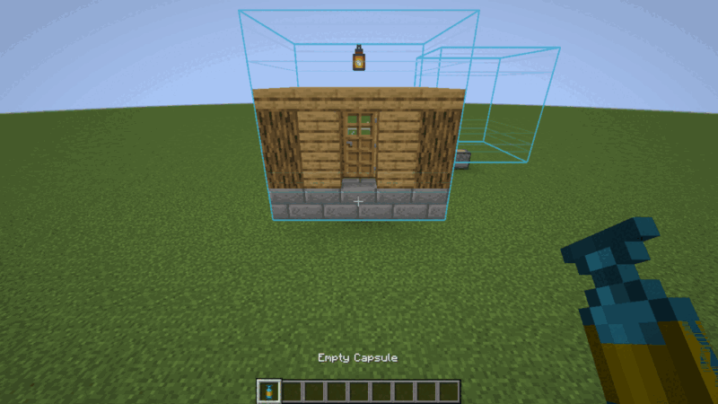 `02-capture-base-with-empty-capsule` | a 5×5×5 house over a capture base and a second, empty capture base; both capture zones drawn as wireframes in the capsule's base color (light blue); the empty capsule held in the right hand | correct |
| 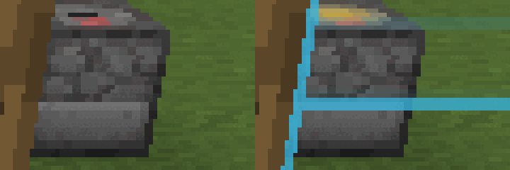 `01-capture-base`, `02-...` (zoom) | the empty capture base: normal top without capsule, activated (yellow) top with an empty capsule in hand | correct |
| 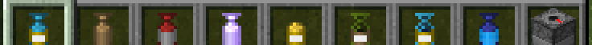 `05-hotbar` | linked (light blue base, gold material, white label), wooden empty, red dyed iron, OP (lavender, enchantment glint), deployed (yellow, open sprite), one-use reward (green), recovery (striped one-use sprite), charged blueprint (blue overlay), capture base (3D block with the red marker on top) | correct: base tint, material tint and per-state sprites |
| 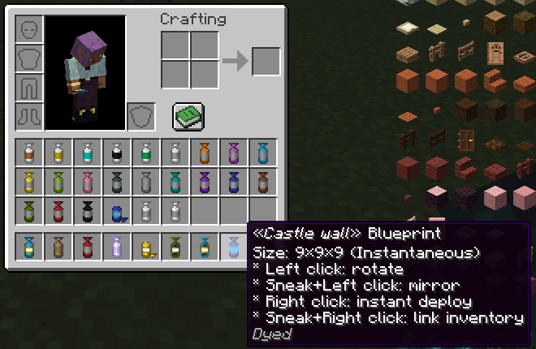 `07-inventory-blueprint-tooltip` | survival inventory: the 16 dye colors on iron capsules, copper/gold/diamond/obsidian/emerald capsules, uncharged blueprint, upgraded and recall-enchanted capsules; blueprint tooltip (size, instantaneous, controls); JEI item list on the right | correct |
| 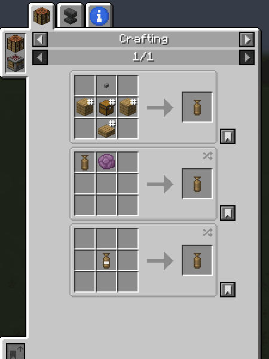 `09-jei-capsule-recipes` | JEI crafting recipes of the wooden capsule: shaped recipe, chorus upgrade, clear | correct; JEI, REI and EMI run on both loaders (`09-jei-…`, `09-rei-…`, `09-emi-capsule-recipes`) |
| `11-deploy-preview` | activated linked capsule in hand, translucent full preview of the captured house where it will deploy | correct |
| 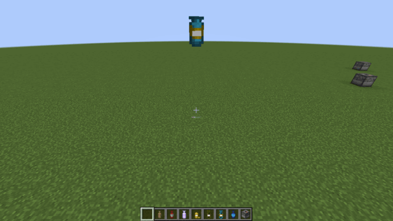 `13-capsule-thrown` | the thrown capsule in the air toward the previewed position | correct |
| 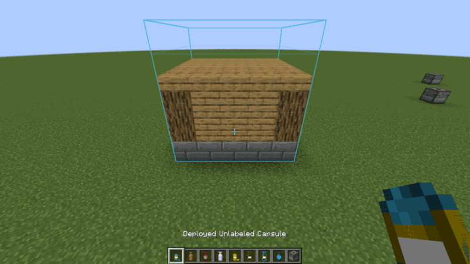 `15-deployed-capsule-in-hand` | the deployed house, rotated 90° as previewed after a left click, with the recall box of the deployed capsule held in hand | correct |
| `17-blueprint-preview` | charged castle wall blueprint, its full preview including cobblestone walls and dark oak fences | correct |
| 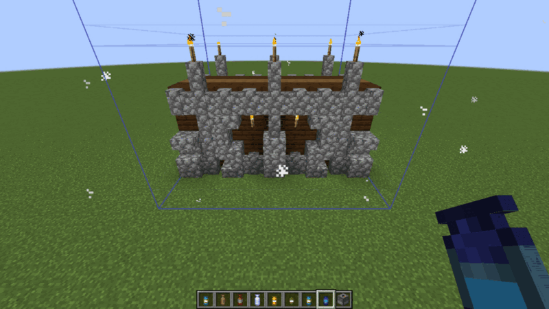 `18-blueprint-deployed` (Fabric) | the deployed castle wall and the recall box of the now uncharged blueprint | correct |
| `11-deploy-preview` with the Create: OneBlock pack | the same preview with the 38 mods of the pack loaded (Create, Sodium, Xaero's Minimap...) | correct |
| `14b-preview-over-deployed` | the translucent preview of the house over the deployed house (leaves, stone and door seen through) | correct, no z-fighting or sorting artifact |
| `19-preview-water-glass-terrain` (also `-fabric`) | the preview standing in water, between glass panes and against a dirt wall | correct: terrain, water and glass visible through the ghost; glass in front of the ghost still hides it (drawn after the translucent terrain, see BACKLOG) |
| 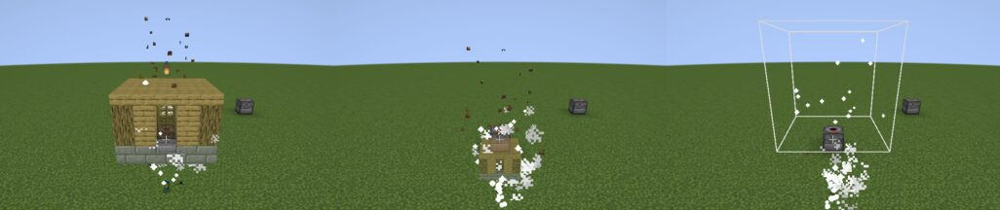 `04a`, `04b`, `04c-capture-animation-unseen` | the captured house shrinking into the capsule on the capture base with an END_ROD particle trail; the fallback shrinking box for a capture the client did not see | correct; frames counted with `captureAnimation` on (23 of 24), none with it off |
| 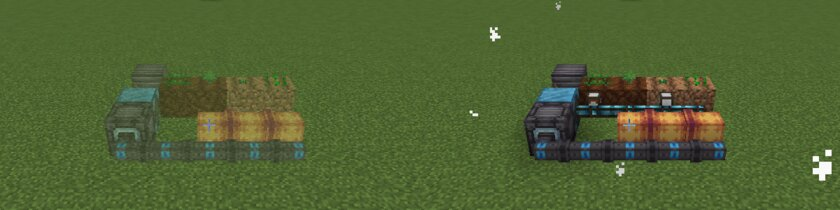 `22-modded-blocks-preview`, `23-modded-blocks-deployed` (CS-modded) | Ad Astra pipes and cables, Integrated Dynamics cables with Integrated Tunnels parts, farmland and crops, Farmer's Delight blocks: preview, then deployed | no crash, deploy correct; Integrated Dynamics cables and parts are missing from the preview (block entity model data, see BACKLOG) |
| 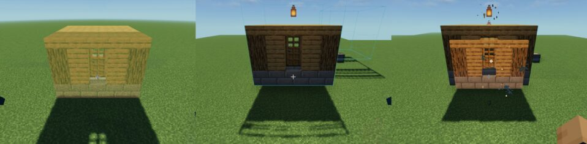 `11-deploy-preview`, `02-…`, `04a-…` (CS-iris) | Iris + Sodium + MakeUp Ultra Fast: the preview, the capture zone wireframe, the capture animation | visible on both loaders; the ghost is tinted yellow by the pack and casts a shadow on NeoForge only (the render stage event also fires in Iris' shadow pass) |

Other screenshots of the run, not copied here: capture base alone, capture particles and the linked capsule on the
ground, linked capsule tooltip, creative search "capsule" (every capsule of the creative tab), third person view
holding a capsule, rotated preview, undeploy particles.

Known visual issues:

- A capture base powered by redstone shows its activated top: the highlight is the dispenser `triggered` property.
  Intended.
- Water and stained glass in front of the preview hide it (BACKLOG).
- Integrated Dynamics cables and parts are not drawn in the preview (#94, BACKLOG).
- With Iris on NeoForge the preview casts a shadow (cosmetic).
- With Sodium (Create: OneBlock run), blocks set by the harness in chunk (0, 0) right after the world loaded were not
  drawn until the chunk changed again; capsule deploys were drawn normally. A harness/Sodium artifact, not a capsule
  issue.

## Third-party mods

| Mods (versions) | How | Result |
|---|---|---|
| SecurityCraft 1.10.2.1 | GT (NeoForge dev runs, always): `othersCannotCaptureSecurityCraftBlocks`, `onlyOwnersPassTheSecurityCraftOwnerCheck` | pass |
| Waystones 21.1.46 + Balm 21.0.66 (#121) | GT-mods: `waystoneStaysWhenCapturedWithADoor`, `...ByAnOverpoweredCapsule` | pass: Waystones tags its blocks `c:relocation_not_supported`, so standard and OP capsules leave both halves in place with their block entity; the door next to it is captured, deployed and undeployed with both halves, no ghost block |
| Sophisticated Storage 1.6.1 + Sophisticated Core 1.5.5 (#115) | GT-mods: `rewardBarrelsDoNotShareTheirContent` | pass; a shared inventory fails it with "emptying the first barrel emptied the second one: 0 diamonds" |
| JEI 19.57.0.451, SecurityCraft, Waystones, Balm, Sophisticated Storage, Sophisticated Core | PS with `EXTRA_MODS`, release jar on a NeoForge 21.1.255 dedicated server | boots, `capsule` command registered, no error in the log, clean stop |
| JEI 19.57.0.451, REI 16.0.799 (+ Architectury API, Cloth Config), EMI 1.1.24 | CS, each viewer on both loaders | capsule recipes and 14 information pages shown; a recipe for each of the 29 tiers; every recipe Capsule adds (upgrades, clear, recovery, blueprints, 6 prefab blueprints, blueprint change) |
| WorldEdit 7.3.8 (#70) | GT-mods NeoForge: `worldEditSchematicsDeploy` | pass: the Sponge v2 and v3 fixtures are written by WorldEdit's own clipboard writers, and WorldEdit reads the hand-made MCEdit and Sponge v1 fixtures |
| Open Parties and Claims 0.32.x, Flan 1.12.8 (#91) | GT-mods, both loaders: `openPartiesAndClaimsVetoesStrangers`, `flanVetoesStrangers` | pass: inside a claim a stranger's capture and capture base are refused, a member's and the owner's allowed; outside the claim allowed |
| Get Off My Lawn ReServed 1.13.1 (#91, Fabric) | PG Fabric with `EXTRA_MODS` (with Open Parties and Claims and Flan): `getOffMyLawnVetoesStrangers` | pass: inside a claim a stranger's capture and capture base are refused, a trusted player's and the owner's allowed, also above the largest survival capsule (33); outside the claim allowed. Not in the GT-mods runtime: the Loom dev runs do not load the mods nested in its jar |
| Integrated Dynamics 1.38.0 (+ Cyclops Core, Common Capabilities, Integrated Tunnels 1.13.0, Refined Storage 2.0.9 for the dev client), Ad Astra 1.16.26 (+ Resourceful Lib, Common Storage Lib, Resourceful Config), Farmer's Delight 1.3.4 (#94, #117, #76) | CS-modded NeoForge, 25 checks | no crash, no capsule error; see the screenshot review above |
| Ad Astra 1.16.26, Farmer's Delight Refabricated 3.2.8 (3.3.x crashes the Fabric dev remapper) | CS-modded Fabric, 20 checks | no crash, no capsule error |
| Mob Grinding Utils (#81) | – | blocked: no 1.21.1 build |
| Corail Tombstone 9.5.6, Refined Storage 2.0.9, Mekanism 10.7.19.85, Immersive Engineering 12.4.2-194, Super Factory Manager 4.34.0 (wiki: Known incompatibilities) | GT with `-Pincompat`, PG NeoForge with `EXTRA_MODS` | pass, results in `docs/TESTING.md` (Known incompatibilities); Tombstone's Soulbound is offered on capsules by enchanting tables (applies to every item) |
| GregTech CEu Modern 7.0.2 + LDLib 1.0.35.a / 1.0.41 | PS NeoForge with `EXTRA_MODS` | blocked: the server does not start (client class loaded on a dedicated server) |
| Iris 1.8.12 (NeoForge) / 1.8.8 (Fabric), Sodium 0.6.13, MakeUp Ultra Fast 9.5g (#69) | CS-iris, both loaders | pass; see the screenshot review above |
| Forgeulously Optimized 1.1.4 (49 mods, NeoForge 21.1.218, Sinytra Connector 2.0.0-beta.12 loading 19 Fabric mods, Sodium, Iris, ModernFix) | CS-modpack: production NeoForge client (`scripts/prod-client.py`), release jar + test mod jar | 42 checks pass, recipe viewer skipped (the pack has none); screenshots look like the dev client's |
| Create: OneBlock 1.3 (Modrinth, 40 mods: Create 6.0.10, Sodium 0.6.13, Sodium Extra, Lithium, ModernFix, FerriteCore, Farmer's Delight, Carry On, Jade, Xaero's Minimap, Sophisticated Backpacks, Curios, Architectury, Forgified Fabric API...) | CS NeoForge with `EXTRA_MODS`, without Sinytra Connector and Trinkets (Connector cannot start in a dev run: "Could not determine clean minecraft artifact path"; Trinkets is a Fabric mod it would load) | full scenario passes, no capsule problem in the log |

## Coverage of TEST.md

"Manual" means a human must check it; the reason is given when it is not obvious.

### Items

| TEST.md item | Covered by | Manual |
|---|---|---|
| Empty capsule recipes (all materials, OP) visible in creative tab and JEI | GT `everyCapsuleRecipeLoadsWithResolvedIngredients` (every tier, modded tags filled by the test resources), `ironCapsuleRecipe`; CS `08-creative-search`, a recipe for each of the 29 tiers in JEI, REI and EMI on both loaders | tier colors |
| JEI information tabs (empty, linked, deployed, recovery, blueprint, OP, capture base) | CS viewer check (14 capsule information pages, JEI, REI, EMI) | reading the texts |
| Tooltips (empty, linked, deployed, recovery, blueprint) | CS `06-inventory-linked-tooltip`, `07-inventory-blueprint-tooltip` | other states' texts |
| Dye (empty, linked, deployed, recovery, blueprint) | GT `dyeRecipeColorsCapsule` (empty); CS sprites of dyed capsules | dyeing each other state in a crafting grid |
| Upgrade with chorus fruit, upgrade limit config (0, 1, 24), not on linked/deployed/recovery/blueprint | GT `upgradeRecipeGrowsCapsule` | limits 0/1/24 and refusals |
| Upgrade item changed by an asset/data pack, JEI updated | | yes |
| Clear recipe (linked → one-use given back, deployed → empty), not on recovery/blueprint | GT `clearRecipeEmptiesCapsule` | deployed and refusals |
| Recovery recipe, recovery deploy empties the source | GT `recoveryRecipeMakesOneUseCopy`, `recoveryCapsuleEmptiesSourceTemplate`; CS recovery recipe in the viewers | shift-click crafting a recovery capsule (no test) |
| Recall enchantment, Loyalty on 1.21.1 (allowed states, enchanting table, anvil) | GT `enchantingTablesOfferLoyaltyForCapsules`, `anvilAppliesALoyaltyBookToACapsule`, `otherTridentEnchantmentsAreRefused`, `loyaltyCapsuleComesBack`, `legacyRecallCapsuleComesBack`, `recallIsNoLongerObtainable`, `recallLetsAnEarlyCollidingCapsuleDeploy` | enchanting each state in an anvil |
| Fire and lava proof capsules | GT `capsuleSurvivesLava`, `capsuleThrownIntoLavaDeploysAndComesBack` | |
| Relabel with sneak + right click (label GUI) | | yes (GUI and keyboard) |
| Preview rotation (90/180/270) with left click | CS `11` → `12-deploy-preview-rotated` (one rotation); UT `rotationKeepsContentInsideTheCapsuleCube` | the four steps and the feel of the controls |
| Mirror with sneak + left click (FRONT_BACK, LEFT_RIGHT, none) | UT `mirrorFlipsOneAxis` | in game |
| Deployed capsule right click undeploys | GT `undeployDeployedCapsule`; CS `15` → `16-undeployed` | |
| One-use / reward deploys and is consumed | GT `rewardCapsuleDeploysTwice`, `recoveryCapsuleEmptiesSourceTemplate` | throwing a recovery capsule in game |
| Blueprint recipes (from linked, blueprint, one-use, reward), change recipes | GT `blueprintRecipeCopiesCapsule`, `BlueprintCraftingTests` (crafting menu, click and shift-click, one-use source, blueprint change) | |
| Blueprint recharge from player inventory, from a linked inventory, from both; materials consumed | GT `blueprintConsumesMaterials` (player inventory), `pottedPlantsAreNotFree` | linked inventory (sneak + right click) and its highlight; Fabric modded storages (Transfer API) |
| Blueprint world recharge (structure must match, dispenser content) | | yes |
| Blueprint whitelist (excluded chest message, note block pitch kept) | GT `everyVanillaBlockEntityIsWhitelistedOrExcluded`, `blueprintsNeverKeepInventories` | the excluded chest message, note block pitch |
| Prefab blueprint recipes generated from `config/capsule/prefabs` | GT `everyBundledTemplateDeploys` (prefabs deploy), `prefabCraft…GivesItsTemplateIngredientsBack` (default and moved pattern), `missingPrefabTemplateIsReported`; CS blueprint from the castle wall prefab, 6 prefab recipes in each viewer | custom prefabs after a restart |

### Blocks, preview, translations

| TEST.md item | Covered by | Manual |
|---|---|---|
| Capture base in creative tab and JEI, recipe | CS `08-creative-search`, `05-hotbar`; GT `everyCapsuleRecipeLoadsWithResolvedIngredients` | |
| Capture base 3D model in world and in hand | CS `01-capture-base`, `04-captured`, `05-hotbar` | in hand (third person) |
| Capture base highlighted with a wireframe when an empty capsule is held | CS `01-capture-base`, `02-capture-base-with-empty-capsule` (wireframe and activated top) | |
| Wireframe preview of a line and a column | | yes (the full preview is shown instead when the template is received; the wireframe shows for size 1 capsules and big templates) |
| Translations (English, French) | | yes |
| Capture animation, `captureAnimation` option | CS `04a`–`04c` (frames counted on and off) | the feel of it in game |
| Translucent preview against terrain, water, glass, the deployed structure | CS `14b`, `19`, `20` | |

### Commands

| TEST.md item | Covered by | Manual |
|---|---|---|
| `giveEmpty` sizes and `overpowered` | PS (`help capsule` lists the commands) | yes |
| `giveLinked`, `giveBlueprint`, `exportHeldItem`, `exportSeenBlock`, `fromHeldCapsule`, `fromStructure`, `fromExistingReward` | CS creates a blueprint the way `giveBlueprint` does | yes |
| `giveRandomLoot` with `allowBlueprintReward` | GT `defaultLootTablesHoldTheCapsulePool`, `capsuleLootEntryRoundTrips` | the config switch |
| `reloadLootList`, `setBaseColor`, `setMaterialColor`, `setAuthor` | GT `reloadRefreshesRewardTemplates` (reload) | yes |

### Features

| TEST.md item | Covered by | Manual |
|---|---|---|
| Starters (`starterMode` all/random/none, given once per player) | | yes (needs new players and relogs) |
| Instant capsules (size 1): capture without capture base, deploy without throw | GT `instantCaptureWorksAtPreviewRange`, `instantCapsuleCannotUndeployInstantly`, `instantCapsuleUndeploysAfterRelog` | |
| Overridable blocks (grass replaced, grown grass captured, not deployed over stone) | GT `overridableBlocksAreReplaced`, `solidBlocksPreventDeploy`, `deployReplacesTheAimedSnowLayer` | grown grass round trip |
| Transdimensional deploy and throw through a portal, with recall | | yes |
| Underwater deploy and throw on water | | yes |
| Dispenser throws an activated capsule | GT `freshCaptureBaseDispensesOnFirstSignal` | the vertical dispenser with a button |
| Initial capture over a capture base (thrown empty capsule) | GT `thrownCapsuleCapturesAboveCaptureBase`; CS `02` → `04-captured` | |
| Excluded blocks (end portal frame, bedrock; OP capsule) | GT `excludedBlocksStayInPlace`, `configuredTagsExcludeBlocksFromCapture`; UT `tagsAreReadWithOrWithoutHash` | OP capsule with the end portal frame |
| Dynamic prefab recipes | | yes |
| Loot in desert pyramids, not in dungeons with a custom config | GT `defaultLootTablesHoldTheCapsulePool` | the custom config |
| Minecart with content undeployed/deployed drops nothing | | yes |
| Schematics as templates (`.nbt`, MCEdit, Sponge v1–v3, `.schem`) | GT `SchematicTests`, GT-mods `worldEditSchematicsDeploy` | |
| Item frames deployed on their blocks, no "invalid position" log | GT `deployedItemFramesHangOnTheirBlocks`, `starterCraftingTablesHaveAFreeFace` | |
| Claim mods (#91) | GT `ClaimTests`; GT-mods Open Parties and Claims and Flan, both loaders; PG Get Off My Lawn, Fabric | see below |

## Must be validated by a human

- Multiplayer on a real server with latency: throw and preview synchronisation, previews of other players' capsules,
  the label GUI.
- Claims on a real server with real players: Flan or Get Off My Lawn, a capture base placed by a player who is
  offline when it fires, a party member and a stranger.
- Sounds (no sound device in the container) and keyboard/mouse feel: rotation and mirror controls, relabel GUI.
- Other shader packs than MakeUp Ultra Fast; OptiFine does not exist for 1.21.1.
- REI and EMI in a production client or modpack.
- Fabric: blueprint material sources in modded storages (Transfer API).
- Mob Grinding Utils (#81) once it has a 1.21.1 build.
- Other modpacks than the two tested.
- Everything marked "yes" or listed in the "Manual" column above.
