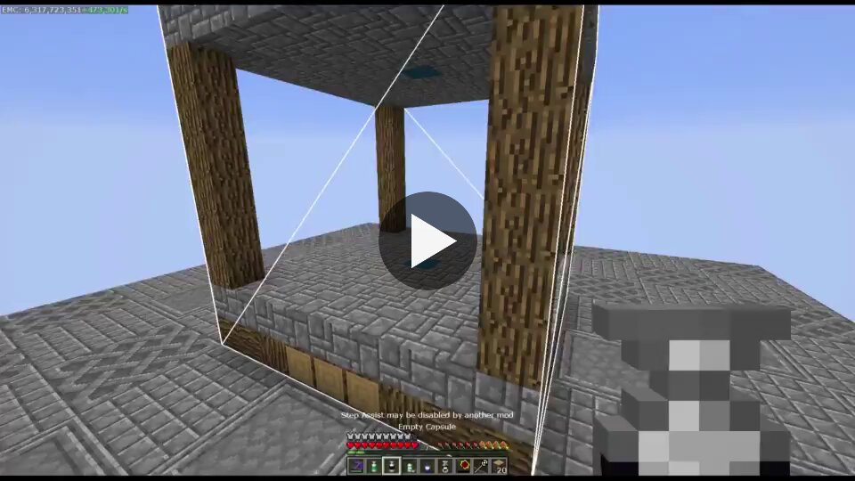
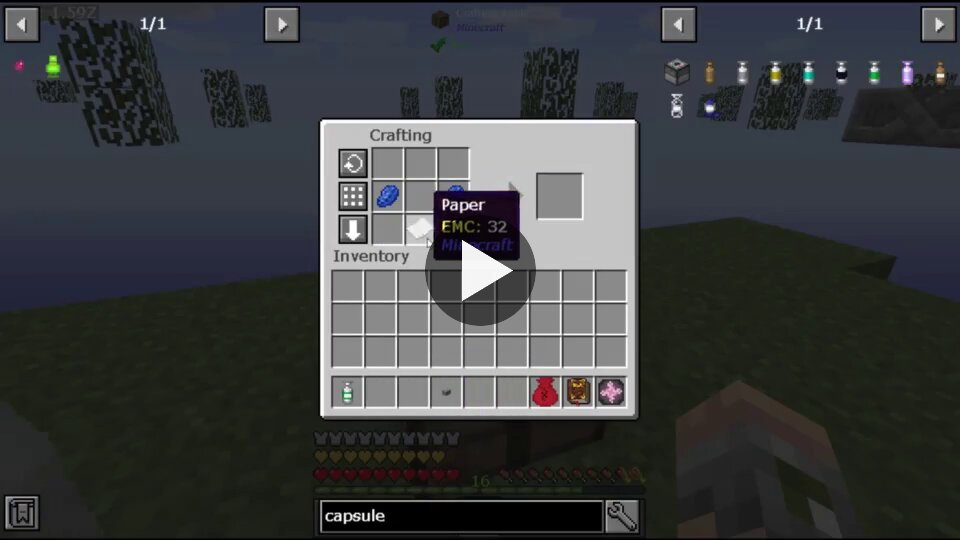
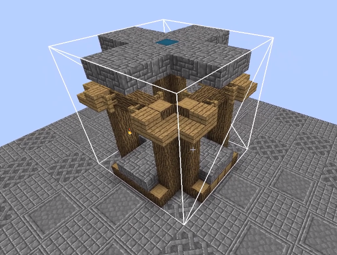
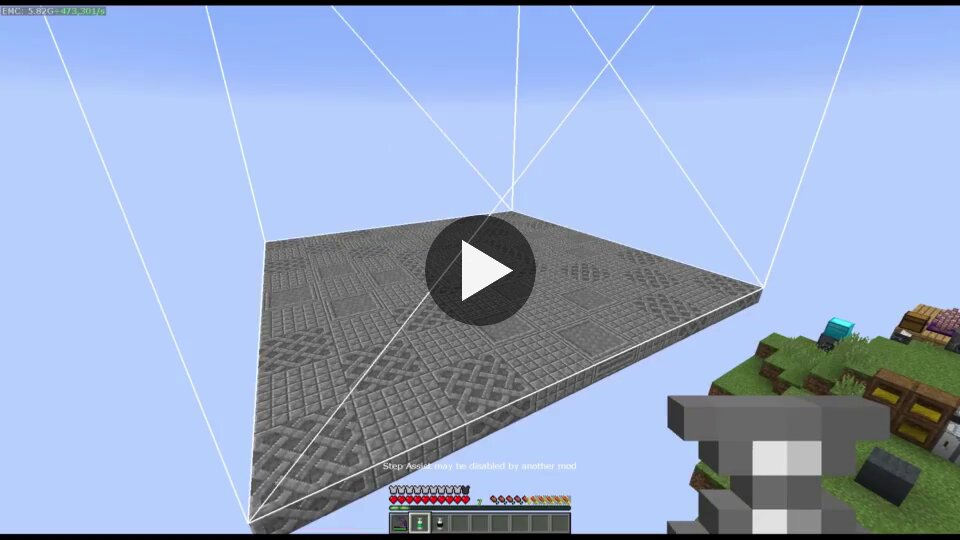
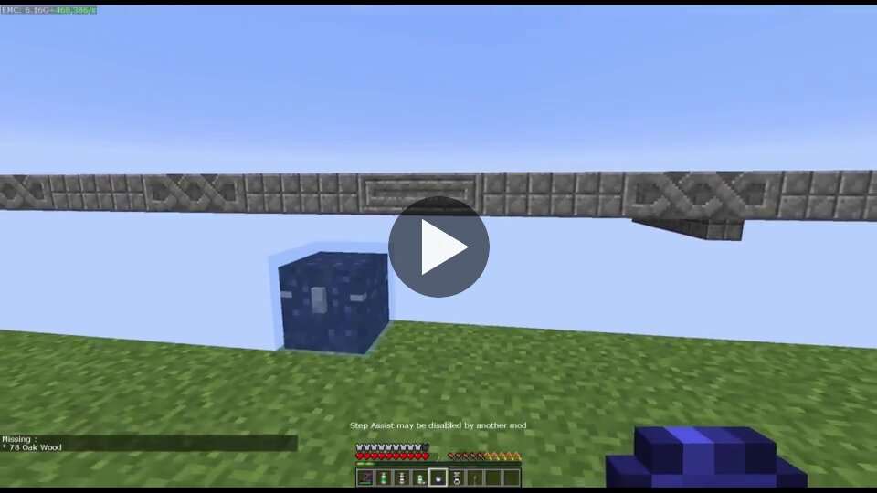
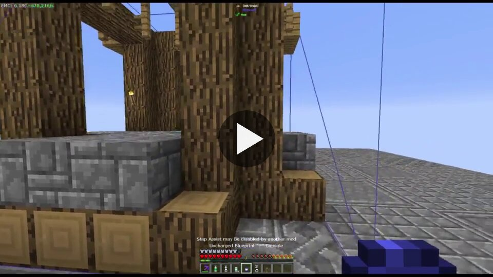
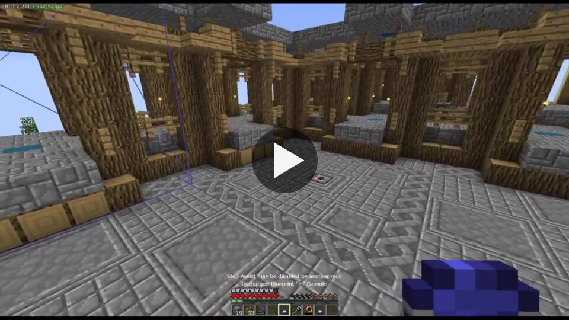
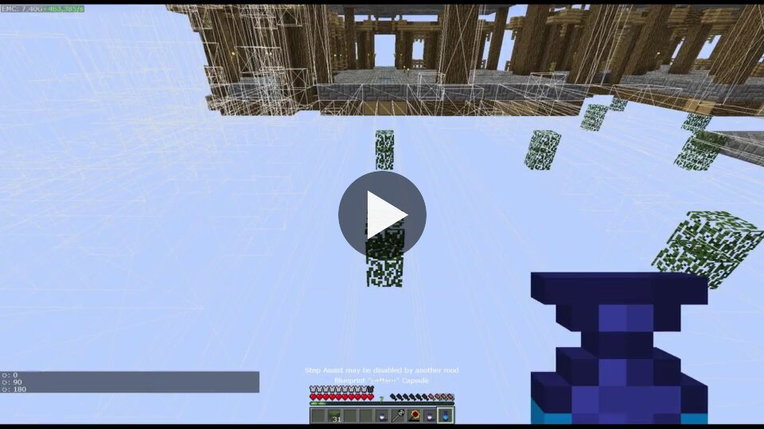
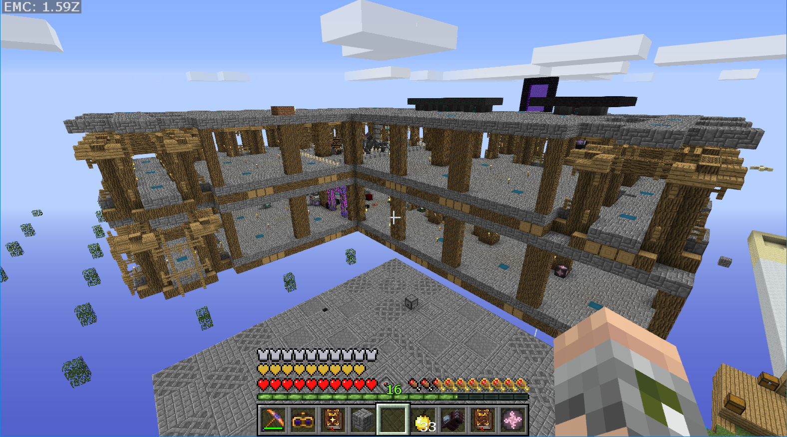

# Capsule Mod: builder's daydream update (Forge 1.12.2)

_Showcase of the blueprints, published on imgur on 2019-06-05 for Capsule 1.12.2-3.2.91. Full list of changes in the
[changelog](https://github.com/Lythom/capsule/blob/master/CHANGELOG.md). Click a picture with a ▶ to play its video._

The controls are still the same today; see [Blueprints](Home#blueprints) for the current documentation.

---

Capturing a basic 9x9x9 structure using the empty capsule.
Notice the elevator block in the middle, it will reveal itself later on!

Download Capsule mod on CurseForge: https://www.curseforge.com/minecraft/mc-mods/capsule

---

Crafting the blueprint out of the capsule.
The original capsule is not consumed, only its template is copied to the blueprint.

---

Creating a "+" shaped blueprint the same way.
I placed elevators here as well.

---

**The platform** is 27x27, so that I can combine my 9x9x9 structures together. A Capture Base is in the middle.
The wireframe previews what the 9x9x9 and 27x27x27 empty capsules would capture.

---

Linking the chest and loading materials… Oops! Some items are still missing to reload the blueprint.
That's not where the elevator was supposed to reveal itself…

---

Got everything this time! Load and deploy!

---

Experimenting to find a 27x27 pattern I like.
Yeah, it's that fast to build now that I have the blueprint and the materials ready.

---

After deploying the first 27x27 platform, I'm rotating and placing a second 27x27 platform aside.

---

And then I needed a second floor, so I just deployed more of the 27x27 pattern :)
And that's where the elevators shine: I can move easily between the floors!
Thanks for reading, have fun with capsules!

Download Capsule mod on CurseForge: https://www.curseforge.com/minecraft/mc-mods/capsule
