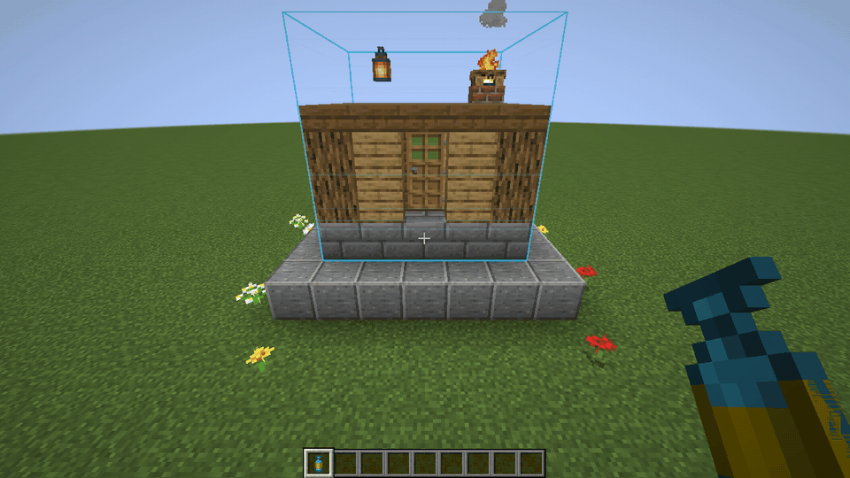
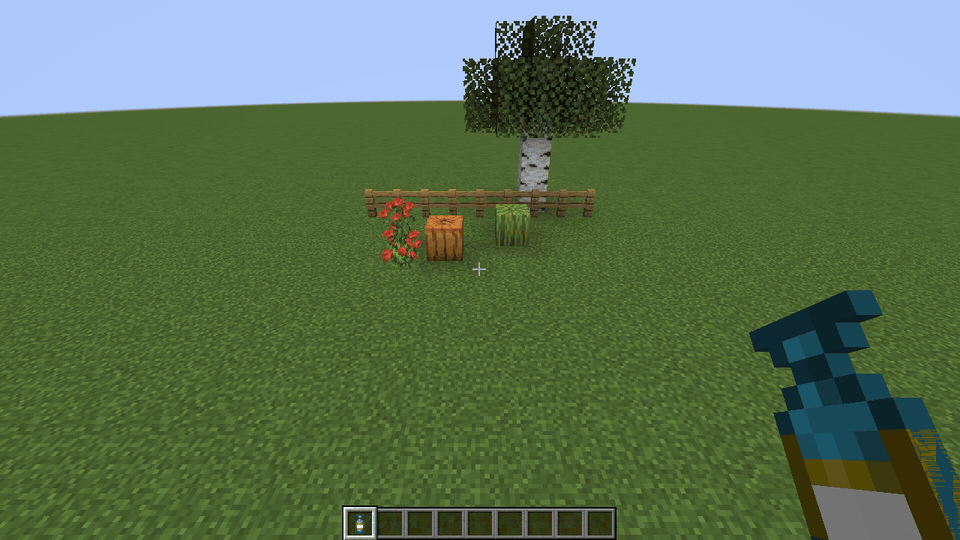
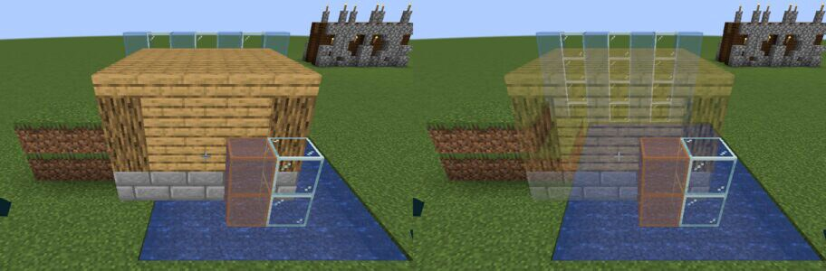
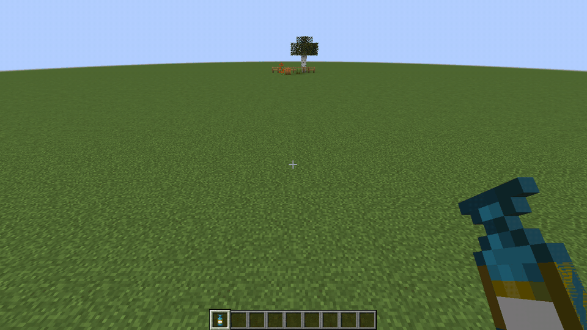
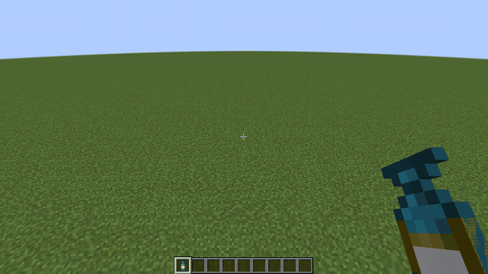
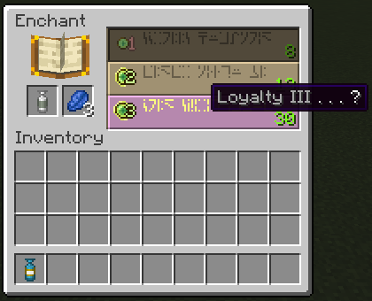
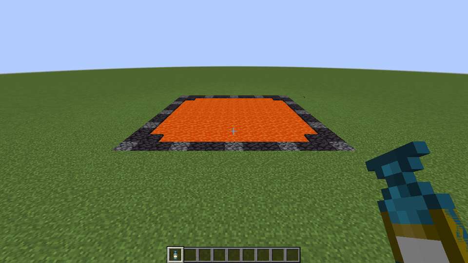
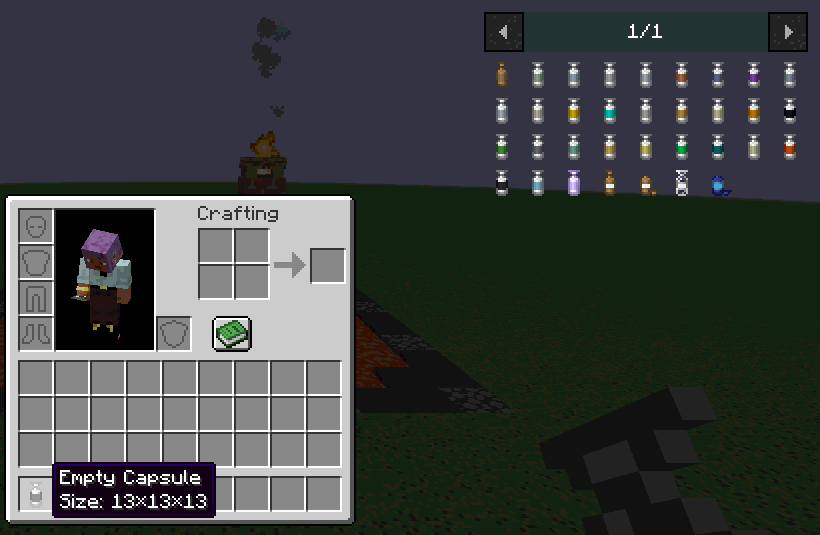
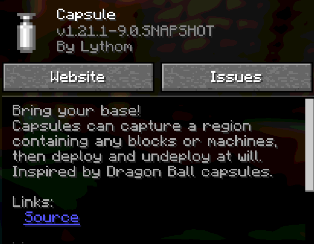
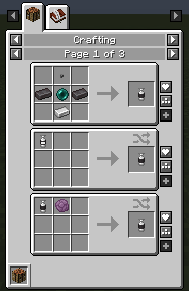

# Capsule 9.0 for Minecraft 1.21.1: Fabric, Loyalty, claim mods

_Capsule 9.0 brings the mod to Minecraft 1.21.1 on **NeoForge** and **Fabric**, with the same features, recipes and
config file on both. Download it on [CurseForge](https://www.curseforge.com/minecraft/mc-mods/capsule/files) or
[Modrinth](https://modrinth.com/mod/capsule/versions). Full list of changes in the
[changelog](https://github.com/Lythom/capsule/blob/master/CHANGELOG.md). Recorded in game with Capsule 9.0._

---

**Capture animation.** Captured blocks are now sucked into the capsule with a particle trail (#106).
It is client side only: turn it off with `captureAnimation = false` in `config/capsule-client.toml`.

---

**Translucent preview.** Before: the full deploy preview hid the terrain. Now it is translucent, so you see what is
behind it (#88). Walls, fences and panes no longer go missing from it on NeoForge.

---

Left click rotates the preview ("Rotation: 90°" in the chat), sneak + left click mirrors it.

---

The preview against terrain, water and glass, before and after. Water and stained glass in front of the preview still
hide it.

---

**Bring your base!** Throw the capsule to deploy, right click it to bring your base back, wherever you are.

---

**Loyalty.** The vanilla Loyalty enchantment brings thrown capsules back to your hand, and replaces Recall (#123, #96).
Any level works.

---

Get it from the enchanting table, or from a book on an anvil. Capsules already enchanted with Recall keep coming back.

---

**Fire and lava proof.** Capsules no longer burn, existing ones included: a capsule thrown into lava deploys, and comes
back with Loyalty.

---

**New tiers, up to netherite.** Amethyst and quartz (5), prismarine crystals (9) and netherite (13): a 13x13x13 capsule
with vanilla items only (#120). With mods: zinc and aluminum (3), osmium (5), brass (7), steel and uranium (9). Modded
recipes only show when a mod adds the ingot. See [Capsule tiers](Home#capsule-tiers).

---

The netherite capsule: netherite ingots on each side of the ender pearl.

---

**Claim protection.** You can't capture or deploy where you are not allowed to build (#91): Open Parties and Claims,
Flan, Get Off My Lawn ReServed (Fabric) and the protection mods that listen to NeoForge's block placement event or
implement Common Protection API on Fabric. Protected blocks stay in place on capture, and a deploy touching them is
refused. Capture Bases act for the player who placed them. See [Claim protection](Home#claim-protection).

---

**Fabric.** The Fabric build (`Capsule-fabric-1.21.1-...jar`) needs Fabric API and Forge Config API Port. The NeoForge
jar is now named `Capsule-neoforge-1.21.1-...jar` and needs NeoForge 21.1 or later.

---

**REI, EMI and JEI.** The capsule recipes and information pages show in REI and EMI, and in JEI on Fabric too. Every
viewer now shows the recovery and blueprint recipes.

---

**Blueprints** take their materials from a linked chest (sneak + right click a chest to link it, left click to charge).
New in 9.0: signs keep their text and banners their patterns, and heads, campfires, shulker boxes, decorated pots,
chiseled bookshelves and crafters can be used (#101). Blocks without an item, like potted plants, now cost their items
(#56). See [Blueprints](Home#blueprints).

---

## Major bug fixes

**Crashes and disconnections**
- Server crash or kick with some install paths: Flatpak ATLauncher, names reserved by Windows, GDLauncher's relative
  instance paths ([#125](https://github.com/Lythom/capsule/issues/125), [#71](https://github.com/Lythom/capsule/issues/71),
  [#77](https://github.com/Lythom/capsule/issues/77), [#93](https://github.com/Lythom/capsule/issues/93))
- "Invalid player data" disconnections with mods serializing loot tables, like Roughly Enough Resources ([#109](https://github.com/Lythom/capsule/issues/109))
- The full preview no longer crashes with modded blocks (Ad Astra pipes, Integrated Dynamics cables, farmland, Mob
  Grinding Utils dirt) ([#117](https://github.com/Lythom/capsule/issues/117), [#94](https://github.com/Lythom/capsule/issues/94),
  [#76](https://github.com/Lythom/capsule/issues/76), [#81](https://github.com/Lythom/capsule/issues/81))
- Template files with uppercase letters or spaces disconnected players on login: they are now skipped with a warning
- Invalid ids in the `excludedBlocks` config crashed the game, and block tags in it were ignored

**Dupes and lost items**
- Chest boats, chest minecarts and other container entities no longer drop their items when a failed deploy is rolled
  back ([#113](https://github.com/Lythom/capsule/issues/113))
- Furnaces dropped their stored experience on every capture ([#122](https://github.com/Lythom/capsule/issues/122))
- Shift-click crafting of blueprints and recovery capsules created extra capsules, and prefab blueprint recipes gave
  back the wrong items ([#84](https://github.com/Lythom/capsule/issues/84))
- Blocks without an item (potted plants…) were free in blueprints ([#56](https://github.com/Lythom/capsule/issues/56))
- Starter and reward capsules shared block entity data with their template, which emptied Sophisticated Storage
  containers ([#115](https://github.com/Lythom/capsule/issues/115))
- SecurityCraft blocks could be captured by players who don't own them ([#119](https://github.com/Lythom/capsule/issues/119))
- The server now checks capsule throws: no instant capture or deploy from a non-instant capsule or out of reach
  ([#91](https://github.com/Lythom/capsule/issues/91))

**Deploying**
- Deploys floated above snow layers and grass ([#116](https://github.com/Lythom/capsule/issues/116))
- Blind throws deployed one block above the ground ([#89](https://github.com/Lythom/capsule/issues/89))
- Recall brought capsules back before they could deploy ([#98](https://github.com/Lythom/capsule/issues/98))
- Instant capsules could not be undeployed after a relog or restart ([#75](https://github.com/Lythom/capsule/issues/75))
- Blueprints whose template could not be read were created empty without a message ([#124](https://github.com/Lythom/capsule/issues/124))
- A new Capture Base ignored its first redstone signal

**Content and rendering**
- Capsules never appeared in dungeon loot on 1.21.1
- The uncommon well loot capsule had infested blocks ([#100](https://github.com/Lythom/capsule/issues/100))
- The starter huts' axe item frame covered the crafting table ([#126](https://github.com/Lythom/capsule/issues/126))
- The preview, the capture zone wireframe and the capture animation show with Iris shader packs ([#69](https://github.com/Lythom/capsule/issues/69))
- Capsules were held edge-on in first and third person
- The rotation message showed a circle (a symbol missing from the Minecraft font): it now says "Rotation: 90°"
- Blueprints with a structure block asked for a structure block item holding its seed (`blueprint_whitelist.json`,
  new installs only)

## Also in this release

- **Schematics**: Sponge v3 schematics and `.schem` files (the WorldEdit 7.3 default) can be used as templates, next to
  `.nbt`, MCEdit and Sponge v1 and v2 files ([#70](https://github.com/Lythom/capsule/issues/70)). See
  [Template files](Modpack-making#template-files).
- **Blueprint whitelist** updated to the 1.21.1 block entities ([#101](https://github.com/Lythom/capsule/issues/101)).
  Inventories are never kept.
- **Commands**: `/capsule giveLinked <template> <player> true` gives the capsule with Loyalty. `exportHeldItem` and
  `exportSeenBlock` print the 1.21 data component syntax, ready for `/give`. `fromHeldCapsule` without a name uses the
  capsule label again. See [Commands](Commands).
- **Config files are never overwritten**: existing installs keep their copy. Delete them to get the new defaults:
  `config/capsule/blueprint_whitelist.json` (new whitelist), `config/capsule/starters` (fixed huts),
  `config/capsule/loot` (fixed loot templates). The Recall entries of `capsule-common.toml` are unused since 9.0.
- Clients and servers must run the same Capsule build: the prefab blueprint recipes sent to clients changed.

## Backports to Forge 1.20.1, 1.18.2 and 1.16.5

The bug fixes above that apply to these versions reach the next Forge builds: **1.20.1 8.0.x**, **1.18.2 6.0.x** and
**1.16.5 5.0.x**. They also get
the claim protection: Open Parties and Claims and Flan on 1.20.1 and 1.18.2, Flan on 1.16.5, and the block placement
event for the other protection mods, per block up to the largest survival capsule (31 by default there: an emerald
capsule with 10 upgrades, 33 with a mod adding platinum). Plus:

- Container entities no longer drop their items when captured or when a failed deploy is rolled back
  ([#113](https://github.com/Lythom/capsule/issues/113)): chest boats and chest minecarts on 1.20.1 (the 1.20.4 fix),
  modded container entities on 1.18.2 and 1.16.5 (vanilla minecarts were already emptied there).
- The blocks tagged `forge:relocation_not_supported` (Mekanism Digital Miner, Refined Storage network blocks) are never
  captured. On 1.20.1 and 1.18.2 the optional entries of `capsule:excluded` were ignored, Tombstone graves included:
  they now apply. New installs also exclude the Blood Magic alchemy table, the Immersive Engineering wire connectors
  and waystones ([#121](https://github.com/Lythom/capsule/issues/121)); existing configs keep their lists, see
  [Known incompatibilities](Known-incompatibilities).
- The rare castle kit and the blueprint discovery loot give and mention blue dye instead of lapis, like the blueprint
  recipe ([#99](https://github.com/Lythom/capsule/issues/99), [#84](https://github.com/Lythom/capsule/issues/84)).
  Delete `config/capsule/loot` to get the updated templates.
- 1.20.1: the rotation message says "Rotation: 90°" too.
- 1.18.2 and 1.16.5: Capsule no longer crashes at startup when it can't read a block's material, as reported with
  Snow! Real Magic ([#78](https://github.com/Lythom/capsule/issues/78), [#68](https://github.com/Lythom/capsule/issues/68)).

The new features (Loyalty, fire proof capsules, new tiers, translucent preview, capture animation, REI and EMI, Sponge
v3 schematics, blueprint whitelist) stay 1.21.1 only.
