# Overview

Bring your base! Capsules can capture a region containing any blocks or machines, then deploy and undeploy at will. Inspired by Dragon Ball capsules.

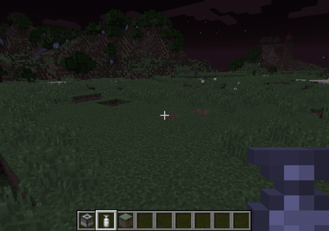

Capsule 9.1 is available for Minecraft 1.21.1 on **NeoForge** and **Fabric** (Fabric needs Fabric API and Forge Config API Port). Minecraft 1.20.1, 1.18.2 and 1.16.5 versions run on **Forge**, see [Previous versions](Previous-versions) for older ones.

Features marked [since x.y] need at least that Capsule version: 9.1 is the 1.21.1 release.

This page is the player guide. Modpack makers and server owners: see [Modpack making](Modpack-making) and the [Commands](Commands).

- [Overview](#overview)
  * [Getting started](#getting-started)
  * [Getting bigger](#getting-bigger)
    + [Capsule tiers](#capsule-tiers)
    + [Empty Capsule](#empty-capsule)
    + [Linked Capsule](#linked-capsule)
    + [What goes into a capsule](#what-goes-into-a-capsule)
  * [Upgrading](#upgrading)
  * [Backup](#backup)
  * [Emptying a capsule](#emptying-a-capsule)
  * [Loyalty](#loyalty)
  * [Fire and lava](#fire-and-lava)
  * [Blueprints](#blueprints)
  * [Reward, loot and starter capsules](#reward-loot-and-starter-capsules)
  * [Automation with dispensers](#automation-with-dispensers)
  * [Claim protection](#claim-protection)
  * [Recipe viewers](#recipe-viewers)
  * [Overpowered Capsules](#overpowered-capsules)
  * [Overridable blocks](#overridable-blocks)
  * [Client options](#client-options)
- [Changelogs](#changelogs)
- [FAQ](#faq)

## Getting started ##

The first capsule you will have access to is made of wood. Its size is 1x1x1, which enables the "instant mode".

> 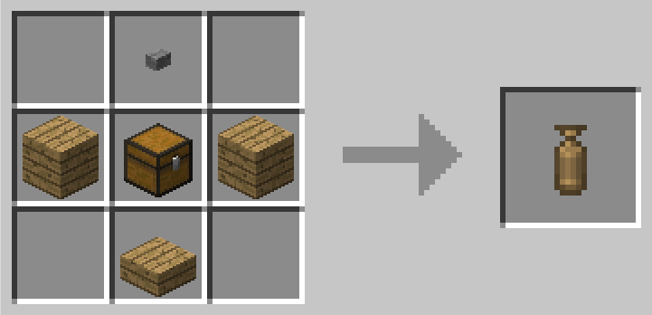
> 
> "Wooden capsule" recipe: a stone button, a chest between two planks and a wooden slab (any wood)

It means you can capture any block (i.e. a chest or a crafting table) by right clicking it, then deploy and undeploy it instantly by right clicking again with the capsule in hand. No Capture Base is needed, and the preview of the deployment is always displayed.

If right clicking opens a GUI, try to capture from a distance or while sneaking.

Capsules work from the main hand only.

## Getting bigger ##

To go bigger you need a Capture Base. This is where you can initialize a capsule with its first content.

> 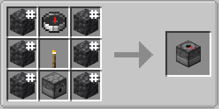
>
> "Capture Base" recipe: a compass on top, a torch in the middle and a dispenser at the bottom, surrounded by 6 cobblestone.

[since 1.16.5-5.0.70] The Capture Base is directional, like a dispenser: it captures the region in front of its marked face. Place it while looking down to capture the region on top of it: place it somewhere just below what you want to capture, or in a free space and build on top of it. While you hold an empty capsule, the Capture Base lights up and a wireframe shows the region the capsule would capture.

Then you need to craft at least one empty capsule (the top item is a stone button):

> 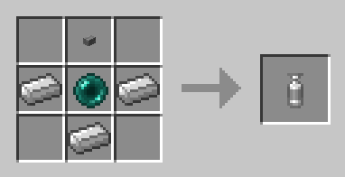
>
> "Iron Empty Capsule" recipe, default capture size: 3x3x3
>
> 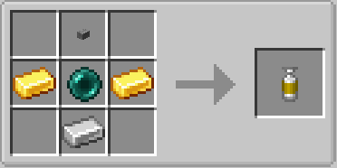
>
> "Gold Empty Capsule" recipe, default capture size: 5x5x5
>
> 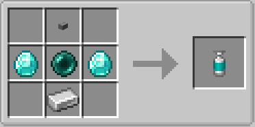
>
> "Diamond Empty Capsule" recipe, default capture size: 7x7x7
>
> 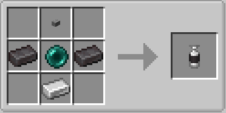
>
> [since 9.1] "Netherite Empty Capsule" recipe, default capture size: 13x13x13

### Capsule tiers

Every empty capsule is crafted the same way: a stone button on top, the material left and right of an ender pearl, an iron ingot below. The material sets the capture size and the color of the cap. Check JEI, REI or EMI in game for every recipe.

| Size | Vanilla materials | Materials from other mods |
|---|---|---|
| 1 | Wood (planks, chest and wooden slab, see above) | |
| 3 | Iron | Copper (vanilla copper since 1.17), Tin, Zinc [since 9.1], Aluminum [since 9.1] |
| 5 | Gold, Amethyst [since 9.1], Quartz [since 9.1] | Lead, Silver, Osmium [since 9.1] |
| 7 | Diamond | Bronze, Brass [since 9.1], Invar, Nickel |
| 9 | Obsidian, Prismarine crystals [since 9.1] | Steel [since 9.1], Uranium [since 9.1], Constantan, Electrum |
| 11 | Emerald | Enderium, Lumium, Signalum |
| 13 | Netherite [since 9.1] | Platinum |

- The modded recipes [since 1.15.2-4.0.51] only show when a mod adds the matching ingot.
- [since 9.1] Netherite is the vanilla 13x13x13 capsule. An emerald capsule with one [upgrade](#upgrading) or a gold capsule with four also reach 13.
- The overpowered capsule (iron ingots and a nether star) is 1x1x1, see [Overpowered Capsules](#overpowered-capsules).

### Empty Capsule

* Right click: activate. The capsule stays activated for 6 seconds (configurable).
* Right click while activated: throw the capsule. Throw it near the Capture Base: when it lands, the region in front of the Capture Base is captured.
* Once the content is captured, the capsule can be deployed or undeployed at will.
* [since 9.1] The captured blocks are sucked into the capsule with a particle trail (can be turned off, see [Client options](#client-options)).

[Click to see the Initial capture demo    
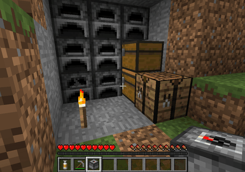](images/demo/initial-capture.gif)

[since 9.1] [Click to see the capture animation    
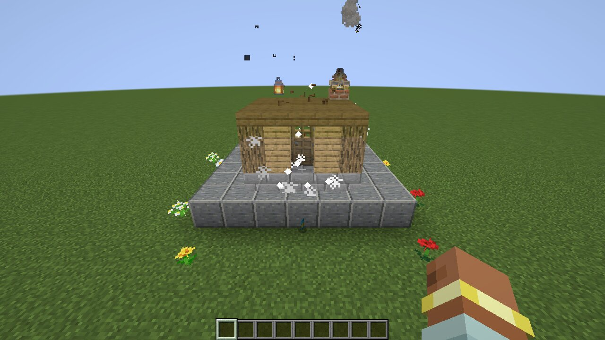](images/changelog-9.1/01-capture-sucked-in.gif)

Note that all the capsules can be dyed in a crafting grid with any dye (it changes the base color), and non-empty capsules can be labeled (sneak + right click).

### Linked Capsule

Usage:

* Deploy: right click once to activate. A preview shows where the content will be deployed: where you look, up to 18 blocks away plus the capsule size. Right click again to throw the capsule at the previewed position. When you don't aim at a block, the capsule deploys where it lands.
* Undeploy: right click the "Deployed" capsule and the content will be stored again into the capsule, wherever it currently is (even from another dimension). While you hold a deployed capsule, a box shows where its content is.
* Rotate and mirror: left click while previewing to rotate, sneak + left click to mirror (see [About rotations](#faq)).
* Label: sneak + right click to open the label editing screen.

[since 9.1] The full preview is translucent: you can see the terrain and blocks behind it. Water and stained glass in front of the preview still hide it.

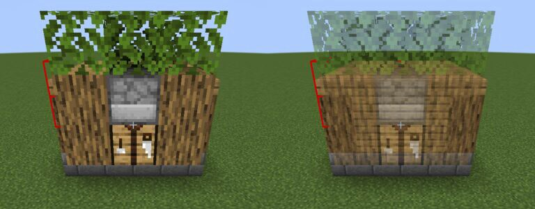

Deploying rules:

* The content cannot be deployed if a block is in the way: the blocks in the way are shown in red in the preview, and nothing is placed. [Overridable blocks](#overridable-blocks) like grass or snow are replaced.
* Mobs in the way prevent the deploy ("Can't deploy: ... in the way!"). Players don't: they are pushed up on top of the deployed content.
* Capsules deploy on the surface of water or lava, unless you are underwater yourself.
* Blocks that were already there before the deploy (for example grass the deploy replaced) are not taken back by the undeploy.

### What goes into a capsule

* Every block with its content and state: chests keep their items, furnaces and modded machines keep their state until you deploy them. Even multiblocks. Furnaces don't drop their stored experience when captured.
* Non-living entities: minecarts, boats, item frames, paintings and armor stands. Mobs, animals, players and items lying on the ground are never captured.
* Some blocks are never captured and stay in place: spawners, end portals and end portal frames (an [overpowered capsule](#overpowered-capsules) can take them), bedrock, and blocks known to break when moved (see [Known incompatibilities](Known-incompatibilities)).
* [Claimed blocks](#claim-protection) you are not allowed to break stay in place.

## Upgrading ##

You need more space? Here is the upgrade recipe (only works with empty capsules):
 
> 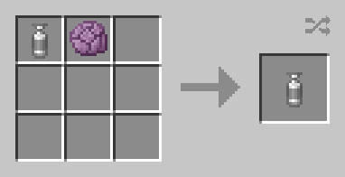
>
> "Capsule upgrade" recipe, default max upgrades: 10

Each Popped Chorus Fruit adds 2 to the capture size (3x3x3 becomes 5x5x5). You can add several Popped Chorus Fruits at a time.

> 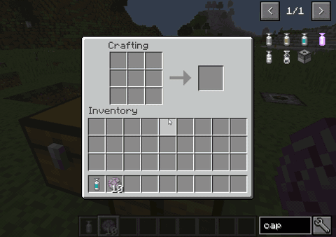
>
> Demo Upgrade

## Backup ##

It's highly recommended that you create a recovery capsule and place it in a safe place! If the capsule is lost (at an impossible death location, (…)), a recovery capsule will allow you to get the content back.

> 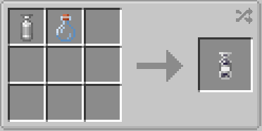
> 
> "Recovery capsule" recipe: the capsule and a glass bottle, in any order. The original capsule is given back.

A recovery capsule is a one-use capsule linked to the same content: deploying it empties the original capsule.

## Emptying a capsule ##

Put a capsule alone in a crafting grid to get an empty capsule of the same size back:

* a linked capsule: you also get a one-use capsule of its content back, so nothing is lost;
* a deployed capsule: the deployed content stays in the world for good and the capsule becomes empty, ready for a new capture or an upgrade.

## Loyalty ##

[since 9.1] Enchant a capsule with the vanilla **Loyalty** enchantment to have it come back into your inventory once thrown: as soon as it has deployed (or touched the ground), it comes back to the player who threw it. When it touches water or lava, it comes back immediately. Without Loyalty you have to pick up the thrown capsule manually.

* Any level of Loyalty works, from an enchanting table or from a book on an anvil.
* Capsules only take Loyalty, not the other trident enchantments.
* Capsules already enchanted with Recall (before 9.1) keep coming back.

**Before 9.1 (1.21.1-9.0.x and older versions): Recall.** The mod adds its own enchantment, Recall, that works the same way. It is intended to be used on capsules, and can be applied to any enchantable item by configuration (disabled by default), which can be useful against inventory dropping monsters or to prevent unintentional drops. Since 9.1 Recall can no longer be obtained.

## Fire and lava ##

[since 9.1] Capsules are fire and lava proof, existing ones included: a capsule thrown into lava deploys, and with [Loyalty](#loyalty) it comes back. Before 9.1, a capsule thrown in lava or on a cactus is lost: keep a [recovery capsule](#backup)!

## Blueprints ##

Blueprint capsules can be reloaded in order to deploy the same structure several times, using building materials from an inventory. See the [builder's daydream update](Changelog-1.12.2-Builders-daydream-update) for a showcase.

**Crafting**: a capsule with content (linked, one-use, reward, recovery or another blueprint) in the middle, blue dye on both sides, a stone button on top and paper below. The source capsule is not consumed: only its template is copied to the blueprint. Craft a blueprint with another capsule with content to change its structure.

**Linking an inventory**: sneak + right click an inventory (chest, barrel…) to use it as a source of building materials. Sneak + right click it again to unlink it.

When unloaded (uncharged), left click in the air to load from the linked inventory and the player inventory. If all materials are available they will be consumed to charge the capsule. Otherwise, the missing materials will be displayed.
You can also right click to undo the last deployment: the blocks go back into the blueprint, as long as the area still matches the blueprint structure (no removed or added blocks, no items in inventories).

When loaded:
- Right click to deploy (blueprints are instant: no throw needed)
- Left click to rotate
- Sneak + left click to mirror

What blueprints can hold:
- Plain blocks, doors, torches, redstone, fluids (charged with buckets).
- Blocks with data (chests, signs, banners…) only when they are in the [blueprint whitelist](Modpack-making#whitelist); [since 9.1] most 1.21.1 vanilla blocks are, signs keep their text and banners their patterns. Inventories are never copied: a chest from a blueprint is always empty.
- Blocks without an item (potted plants…) cost their items: a flower pot and the flower.

**Prefab blueprints**: some ready-made blueprints (castle walls, gates and towers, a chicken cooker…) have their own crafting recipe, check your recipe viewer. The blocks of the structure used in the recipe are given back.

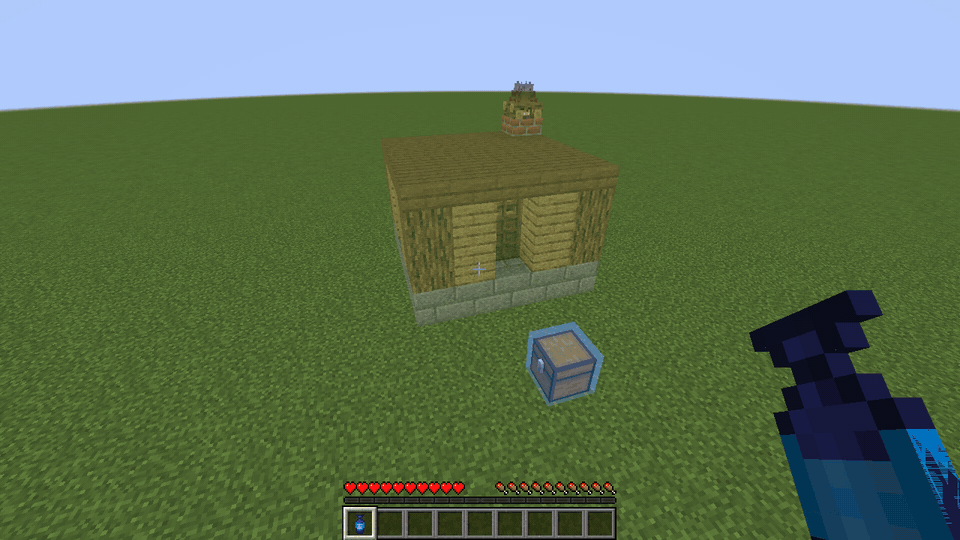

## Reward, loot and starter capsules ##

* **Loot capsules** can be found in dungeon, temple, village, bastion, end city… chests. They are one-use capsules or pre-charged blueprints holding a structure (houses, wells, farms, castle parts…). The author of the structure is credited in the description.
* **Starter capsules**: on your first arrival in a world, you may get a small house to deploy (one random starter by default).
* **Reward capsules** are given by the server or the modpack (quests, commands…).

One-use capsules (including reward and loot capsules) are destroyed once deployed.

## Automation with dispensers ##

[since 1.16.5] Put a linked or one-use capsule in a dispenser or a Capture Base and power it with redstone: the content is deployed in front of it. The next signal undeploys it back into the capsule (one-use capsules are consumed). The Capture Base is a dispenser itself, so it can deploy what it captured.

[since 9.1] In claimed areas, a Capture Base acts for the player who placed it, see [Claim protection](#claim-protection).

See [Ideas and uses](Ideas-and-uses) for an automation made with other mods.

## Claim protection ##

Capsules respect the claim and protection mods: you can't capture or deploy where you are not allowed to build.

* Captures leave the protected blocks in place and take the others.
* A deploy (or a blueprint undo) touching a protected block is refused entirely, with the message "Capsules can't be used here, it might be a protected area."

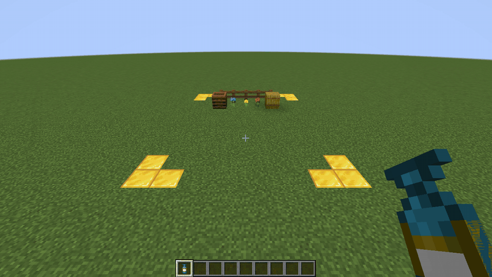

[since 9.1] Supported claim mods:

| Mod | 1.21.1 | Forge: next builds of 1.20.1 8.0.x, 1.18.2 6.0.x, 1.16.5 5.0.x |
|---|---|---|
| Open Parties and Claims | NeoForge, Fabric | 1.20.1, 1.18.2 |
| Flan | NeoForge, Fabric | 1.20.1, 1.18.2, 1.16.5 |
| Get Off My Lawn ReServed | Fabric | – |
| Other mods (FTB Chunks, YAWP…) | NeoForge: block placement event; Fabric: mods implementing Common Protection API | block placement event |

FTB Chunks and Cadmus on Fabric are not supported yet (they don't implement Common Protection API).

* [since 9.1] A Capture Base acts as the player who placed it, and a Capture Base deployed from a capsule acts for the player who deployed it. Capture Bases placed before 9.1, vanilla dispensers and anything else without a player can no longer capture or deploy inside claims: break and place the Capture Base again to give it an owner.
* A capsule thrown by a player who then went offline or changed dimension is still checked for that player.
* When Capsule cannot check a claim mod that is loaded (its API changed in a newer version), every capture and deploy is refused with a chat message, until Capsule is updated. Please report it!
* SecurityCraft blocks can only be captured by their owner.

Before 9.1, Capsule checked each block as if the player placed a block there, which works with most protection mods on Forge. Since 9.1 that check is still made for every block of capsules up to the largest survival capsule (33x33x33 with the default config: a netherite capsule with every upgrade), and once per chunk column for bigger capsules, which can't be crafted (only operators and modpack makers give them). On the next Forge builds of 1.20.1, 1.18.2 and 1.16.5 the largest survival capsule is 31x31x31 by default (an emerald capsule with every upgrade; 33 with a mod adding platinum).

## Recipe viewers ##

Capsule recipes and information pages show in **JEI**, and [since 9.1] in **REI** and **EMI**, on NeoForge and Fabric: every capsule tier, upgrades, recovery, clearing, blueprints and prefab blueprints.

## Overpowered Capsules ##

Overpowered capsules (the enchanted ones) can capture blocks that cannot be captured with standard capsules. They are crafted like an iron capsule with a nether star instead of the ender pearl, and are 1x1x1 (upgrade them to go bigger).

By default a standard capsule cannot capture mob spawners, end portals or end portal frames, whereas overpowered capsules can. Neither can capture bedrock or the blocks known to break when moved. The lists are configurable, see [Modpack making](Modpack-making#excluded-blocks).

## Overridable blocks ##

Overridable blocks are blocks that are simply deleted if they are in the way of a capsule deployment, like grass or snow: by default leaves, snow and every replaceable block (grass, ferns, flowers, vines…). A deploy aimed at snow layers or tall grass replaces them instead of floating above them.

Modpack makers can change the list, see [Modpack making](Modpack-making#overridable-blocks).

## Client options ##

`config/capsule-client.toml`:

* `captureAnimation` [since 9.1] (default `true`): show the captured blocks being sucked into the capsule. Captures of more than 4096 blocks or larger than 64 shrink as a box instead.

The preview, the capture zone wireframe and the capture animation also show with Iris shader packs.

# Changelogs

- [1.21.1: Capsule 9.1](Changelog-1.21.1-9.1) (Fabric, Loyalty, claim mods, new tiers…)
- [1.12.2: Builder's daydream update](Changelog-1.12.2-Builders-daydream-update) (blueprints showcase)
- [1.12.2: Bring your base! update](Changelog-1.12.2-Bring-your-base-update)
- [Ideas and uses](Ideas-and-uses)
- Full changelog: https://github.com/Lythom/capsule/blob/master/CHANGELOG.md

# FAQ

**About rotations**

Standard capsules can be rotated and mirrored by players using left click / sneak + left click while previewing deployment. All vanilla blocks, block entities and non-living entities (minecarts, etc.) are supported, but modded block entities will prevent a rotation by default. This is to prevent messing with modded block entities that have specific considerations about their orientation that Capsule cannot know. A capsule that cannot rotate says "Some complex blocks can't rotate" in its tooltip.

The "can rotate" state might need to be updated when you first acquire a standard capsule (blueprints will always rotate): if rotation is locked and you think it should work, deploy and undeploy the capsule to update it and be able to rotate. If it still can't, there is a special block in the content that does not support rotation.

As a modpack maker, if you want Capsule to still try to rotate some specific block, you can whitelist it for blueprints: it will allow the block both to rotate in regular capsules and to be used in blueprints. Check out the [Blueprint whitelist section](Modpack-making#whitelist). Mirroring can be disabled in the config (`allowMirror`) for multiblocks that don't support it.

**Will block X from mod Y work with capsules?**

If compatible with vanilla structure blocks: yes.    
If not compatible with vanilla structure blocks: no.    
Latest versions of Capsule have been tested a lot with very good results, give it a try! Don't forget to back up your saves anyway, it's always good to have one. See also [Known incompatibilities](Known-incompatibilities).

**Beds and respawn**

Beds won't keep the spawn position after being undeployed (exactly like when you break them), so you may want to avoid beds or use some other mod to ensure your respawn position!

**Can I use it in my modpack?**

Sure! Please simply give a link to this page and mention Lythom as the mod author.

If you have any problem with the mod, feel free to PM me or to submit an issue: [https://github.com/Lythom/capsule/issues](https://github.com/Lythom/capsule/issues).

**How to create capsules with custom structures to put in my pack?**

All the information is at [Modpack making](Modpack-making).

**How to move my capsule from a world to a new one?**

1. In the old world, hold the capsule (undeployed) in your main hand and use the command `/capsule fromHeldCapsule <someName>` (repeat for each capsule to move; [since 9.1, 1.21.1] without a name, the capsule label is used). It will create a file in `config/capsule/rewards` and give you a one-use capsule you can throw away.
2. [If the new world is on the same server you can skip this step] Copy the file from `<oldServer>/config/capsule/rewards/<someName>.nbt` to `<newServer>/config/capsule/rewards/`.
3. In the new world, use the command `/capsule giveLinked <someName>` (repeat for each capsule). It will create a standard capsule from the template.

These commands need operator permissions (level 2).

[1.15+] If you don't have operator permissions and want to download the .nbt file from a remote server, you can use the command `/capsule downloadTemplate`. It will copy the .nbt file of the currently held capsule into a `capsule_exports` folder inside the Minecraft instance directory. This might not work if the content is too big or if the content is not fetched yet (use right click to preview and force the download in this case).
Once you have the .nbt file, you can copy it into `<newServer>/config/capsule/rewards/` and do step 3.

**Where is the content of my capsules stored?**

In the world save: `<world save>/capsules` [since 1.16.5] (`<world save>/structures/capsule` on 1.12.2). Files starting with `C-` are standard capsules, `B-` blueprints. A lost capsule can be recovered from there by a server operator, see the question above.

**1.7.10 version?**

Capsule now relies on structure block mechanics, so I'll only maintain 1.10+ versions.

**Is this open source?**

Yes, here: [https://github.com/Lythom/capsule](https://github.com/Lythom/capsule).

Code, textures and binaries are licensed under the MIT License.

**I have another question!**

You can get help either to use the Capsule mod as a player, or to configure it in your modpack, via the following channels:

* GitHub issues: https://github.com/Lythom/capsule/issues    
* Discord server: https://discord.gg/wZpBVdr
