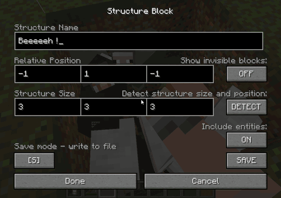

# Modpack making tools

Features marked [since x.y] need at least that Capsule version: 9.0 is the 1.21.1 release (NeoForge and Fabric). The player features are on the [Home](Home) page.

- [Modpack making tools](#modpack-making-tools)
  * [Types of Capsules](#types-of-capsules)
    + [Standard](#standard)
    + [Rewards](#rewards)
    + [Loots](#loots)
    + [Starters](#starters)
    + [Blueprints](#blueprints)
        - [Whitelist](#whitelist)
  * [How to](#how-to)
    + [Create an Empty Capsule](#create-an-empty-capsule)
    + [Create a Reward Capsule](#create-a-reward-capsule)
    + [Add a preconfigured blueprint](#add-a-preconfigured-blueprint)
    + [Relabeling a Capsule](#relabeling-a-capsule)
    + [Setting the author of a capsule](#setting-the-author-of-a-capsule)
    + [Dyeing a capsule](#dyeing-a-capsule)
    + [Setting a deployment offset](#setting-a-deployment-offset)
    + [Create a Template to be used as Loot](#create-a-template-to-be-used-as-loot)
    + [Test looting system](#test-looting-system)
    + [Change starter capsules](#change-starter-capsules)
  * [Template files](#template-files)
  * [Configuration](#configuration)
    + [Excluded blocks](#excluded-blocks)
    + [Overridable blocks](#overridable-blocks)
    + [Tags](#tags)
    + [Recipes](#recipes)
    + [Loyalty](#loyalty)
  * [Claims and protection](#claims-and-protection)
  * [Submit your templates!](#submit-your-templates)
  * [Other tools](#other-tools)
    + [Exporting the item NBT](#exporting-the-item-nbt)
    + [Exporting a block + block entity](#exporting-a-block--block-entity)
  * [Capsule NBT data reference](#capsule-nbt-data-reference)


## Types of Capsules

There are 3 types of capsules to know in order to use Capsule as a modpack making tool.

### Standard

Standard capsules are created live by players while playing. They are stored in `<worldsave>/structures/capsule` (1.12 and older) or `<worldsave>/capsules` (1.16 and newer) for each world.

When the player captures some new content with an Empty Capsule, a new Template file is created there. Through the game, only this crafted Capsule and the Recovery Capsules linked to it can modify the Template file. In-game commands for modpack makers are non-destructive on live created capsules, so you can't mess with players' contents if using commands on a "live" server. The Template file is empty if the capsule is deployed, and contains the captured region data if the capsule is undeployed, so you want to create rewards from undeployed capsules.

#### How to give one

Apart from the player crafting their own capsule, there are 2 ways to give players preloaded standard (reusable) capsules:
- [since 3.2.95] Using the command [`/capsule giveLinked <reward_name> [playerName]`](Commands#givelinked) ([since 9.0] add `true` to give it with Loyalty).
- [since 3.2.95] As a [starter capsule](#starters), given when the player logs in for the first time.

#### About rotation

Standard capsules can be rotated and mirrored by players using left click / sneak + left click while previewing deployment. All vanilla blocks, block entities and non-living entities (minecarts, etc.) are supported, but modded block entities will prevent a rotation by default. This is to prevent messing with modded block entities that have specific considerations about their orientation that Capsule cannot know.

If you want Capsule to still try to rotate some specific block, you can whitelist it for blueprints: it will allow the block both to rotate in regular capsules and to be used in blueprints. Check out the [Blueprint whitelist section](#whitelist).

Mirroring can be disabled with `allowMirror = false` (see [Configuration](#configuration)), for example for multiblocks that don't support it.

### Rewards

Reward capsules are what you would be doing most. They are prepared by the modpack maker, and stored in the `config/capsule/rewards` folder by default (`rewardTemplatesPath`).

Those capsules are always one-use (the item is destroyed when successfully deployed), but the Template file is never emptied. That means a Reward Capsule can be given any number of times to any number of players.

#### How to give one

The players won't be able to get those capsules by themselves. They can be given:

- [since 3.2.95] Using the command [`/capsule fromExistingReward <reward_name> [playerName]`](Commands#fromexistingreward)
- in another reward or loot capsule (#capsuleception :D)
- as a quest reward (choose your favorite quest mod)
- using any mod that can reward an ItemStack with custom data (see [Exporting the item NBT](#exporting-the-item-nbt))
- if using a map template, placed anywhere in the world (chest, item frame, be creative!)


### Loots

Loot capsules are reward capsules that appear in the loot tables of dungeon chests. They are taken from specific folders defined in the config file.

The Template files located under any of the `lootTemplatesPaths` entries in the config file will be eligible to spawn as loot in dungeon chests. They work the same way as Reward Capsules, except they have this additional way to be obtained: the player can find them in a loot chest.

By default, 3 folders are defined in the config file (`config/capsule/loot/common`, `uncommon` and `rare`, weights 10, 6 and 2) that can be filled as you wish. Each folder has a weight: the chance for the folder to be picked rather than another when selecting a loot. To lower the chance of getting a capsule at all, add an empty folder with a weight.

The chests that can hold a capsule are listed in `lootTablesList` (by default mineshafts, bastions, shipwrecks, desert and jungle temples, end cities, igloos, dungeons, strongholds, villages, buried treasures, pillager outposts, ocean ruins and woodland mansions). Any loot table id works, for example `minecraft:gameplay/fishing/treasure` or `minecraft:entities/villager`.

[since 3.2.102] With `allowBlueprintReward = true` (default), a loot template without entities is given as a pre-charged blueprint instead of a one-use capsule.

### Starters

[since 3.2.95] Starter capsules are standard (reusable) capsules given when a player logs in for the first time. Starters can be added or removed in the `config/capsule/starters` folder (`starterTemplatesPath`). To make one, first [create a Reward Capsule](#create-a-reward-capsule), then copy the created structure from `config/capsule/rewards/<structure_name>` to `config/capsule/starters/<label_name>`.

[since 3.3.5] `starterMode` chooses what a new player gets: `random` (default, one random starter), `all`, or `none`. An empty `starterTemplatesPath` also disables starters.

### Blueprints

[since 3.2.95]

Blueprint capsules allow players to build structures multiple times by taking materials from the player inventory and any linked inventory. The blueprint makes it easy to build the structure (i.e. a multiblock or a wall pattern) but still requires the player to gather the materials. Rotation, mirror and undeploy are possible, so it makes it very easy to experiment when placing a structure. See the [blueprint player documentation](Home#blueprints) and [the builder's daydream update](Changelog-1.12.2-Builders-daydream-update) for more information on how to use them as a player.

Blueprints crafted by players have a dedicated template, created when crafted, that is located in the same folder as standard capsules: `<worldsave>/structures/capsule` (1.12 and older) or `<worldsave>/capsules` (1.16 and newer). They can be identified by their prefix: blueprints are prefixed "B-" and standard capsules "C-".

#### How to give one

Apart from the default player recipe, Blueprint capsules can be obtained in 3 ways:
- Using a craft recipe of [preconfigured blueprints](#add-a-preconfigured-blueprint) (the modpack maker can provide specific structures to be craftable).
- Using the command [`/capsule giveBlueprint <reward_name> [playerName]`](Commands#giveblueprint).
- As [loot](#loots), pre-charged.

#### Whitelist

By default block entities are not supported by blueprints. Still, it is possible to add specific block entities to the `config/capsule/blueprint_whitelist.json` file to enable them. An entry can consist of the block id (i.e. "minecraft:chest") or a JSON object with the properties "block" and "keepNBT".

[since 9.0] The default whitelist covers the 1.21.1 vanilla block entities: signs and hanging signs with their text, banners with their patterns, heads, campfires, shulker boxes, ender chests, decorated pots, chiseled bookshelves, the crafter with its disabled slots, command blocks with their command… Inventories are never kept, and blueprint blocks never show a content they lost (chiseled bookshelf books, lectern book, jukebox record, brewing stand bottles). The file is created on the first start and never updated: on existing installs, delete `config/capsule/blueprint_whitelist.json` to get the new list. After editing the file, use [`/capsule reloadWhitelist`](Commands#reloadwhitelist) or restart.

Example from the default 1.21.1 list, the sign text is kept but nothing else:
```json
{
  "block": "minecraft:oak_sign",
  "keepNBT": {
    "front_text": null,
    "back_text": null,
    "is_waxed": null
  }
},
```

Example of the Immersive Engineering conveyor belt, which was whitelisted by default on 1.12.2:
```json
{
  "block": "immersiveengineering:conveyor",
  "keepNBT": {
    "conveyorType": null,
    "conveyorBeltSubtype": "conveyorType",
    "conveyorBeltSubtypeNBT": null,
    "facing": null
  }
},
```
In this example, the conveyor block will be allowed in blueprints:
- the NBT properties of the block entity listed under `keepNBT` will be preserved in the blueprints,
- all unlisted properties will be removed. Typically, only configuration should be kept: "items" or inventory properties, if kept, would lead to dupe issues.

`keepNBT` is a key/value object where almost every property value is `null` except `"conveyorBeltSubtype": "conveyorType"`: it means that the item required to charge this blueprint MUST have the `conveyorType` NBT data, and the value of the item's `conveyorType` must match the value of the block's `conveyorBeltSubtype` to be a valid material. A `null` value means the material item doesn't require a specific NBT to be a valid material. In this example it forces the type of conveyor belt in the inventory to match the type of conveyor belt built in the blueprint: not any conveyor belt can be used as item input.

Tips: 
- You can use [`/capsule exportSeenBlock`](Commands#exportseenblock) when looking at a block to display its NBT data and know what values should be added.
- x, y, z, Items/inventory and id properties should not be listed under "keepNBT": you don't want to keep location information (you want it to be forgotten and reset when the blueprint is placed), nor inventory information (because it could lead to dupe bugs), and finally id is not actually NBT data.

Tutorial video that demonstrates some capsule blueprint configuration using the exportSeenBlock command (1.12.2):

[](https://youtu.be/6MpXay8rGFw)


## How to

Manipulating NBT data can be tricky. The Capsule mod includes some commands and tools to help modpack makers create the Capsules they need.

### Create an Empty Capsule

* Use a recipe viewer (JEI, REI, EMI) in cheat mode or the creative mode tab
* Use the command [`/capsule giveEmpty [size] [overpowered]`](Commands#giveempty)
* Use the crafting recipe in a crafting table.

### Create a Reward Capsule

This procedure will have you create a template file located under `config/capsule/rewards`. This config subfolder must be distributed with your pack to have the given capsule item (or any exact copy) work in the player's game.

1. Get an empty capsule,
2. capture the content you want to reward on a Capture Base,
3. finally use the command [`/capsule fromHeldCapsule <structure_name>`](Commands#fromheldcapsule) while holding the capsule in the main hand. The structure is now at `config/capsule/rewards/<structure_name>.nbt`.

To allow more advanced captures:

1. Set up a structure block in save mode,
2. configure it the way you want (you can even capture entities a capsule wouldn't capture, like mobs, or items on the ground),
3. save using a unique name (lowercase only),
4. finally use the command [`/capsule fromStructure <structure_name>`](Commands#fromstructure) where "<structure_name>" is the unique name used previously. The size of the capsule will be calculated to include the whole structure block content.

[Click to see Demo of using `/capsule fromStructure <structure_name>`
](images/demo/from-structure.gif)

Template files from other tools also work, see [Template files](#template-files).


### Add a preconfigured blueprint

To add a new craftable preconfigured blueprint, first [create a Reward Capsule](#create-a-reward-capsule), then copy the created structure from `config/capsule/rewards/<structure_name>` to `config/capsule/prefabs/<label_name>` (`prefabsTemplatesPath`). A recipe for this preconfigured blueprint will be dynamically created and added to the recipe viewers and creative tabs after a restart.

Additional notes:
- The recipe will be created using the `config/capsule/prefab_blueprint_recipe.json` configuration. Capsule will dynamically replace "1", "2" and/or "3" with the most used blocks in the structure to create the final recipe. The blocks from the structure used to craft the recipe are not consumed, so they can be reused to charge the blueprint. You can change the ingredients and move 1, 2 and 3 around in the JSON. The default pattern is `2b3` / `l1l` / ` p ` (b: stone button, l: blue dye, p: paper).
- Blueprints are limited to plain blocks. Block entities are ignored during the blueprint structure copy unless they are listed in the [whitelist](#whitelist).
- If inside a subfolder, a mod with the same id as the folder name must be loaded to enable the recipe (i.e. `config/capsule/prefabs/immersiveengineering/arc_furnace.nbt`).
- Ensure the file name is lowercase only: `_` will be replaced by spaces and each word is capitalized for the capsule label.
- Default prefabs: castle wall, castle wall corner, castle gate, castle tower corner (and its top), chicken cooker.
- [since 9.0] Clients and servers must run the same Capsule build: the prefab recipes sent to clients changed in 9.0.


### Relabeling a Capsule

* Non-empty capsules can be labeled using sneak + right click to show the GUI.
* Renaming a capsule on an anvil is possible, but it will completely override the item naming mechanics and the label will be ignored.

Note: A Loot capsule will always be labeled using the name of the file (without .nbt), The Name Will Be Capitalized.

### Setting the author of a capsule

You may want to feature any creator's content (may it be yourself!), so an author can be set to give credit to the person who designed the content by using the command [`/capsule setAuthor <name>`](Commands#setauthor). The <name> will appear in the Capsule description as "Designed by <name>".

### Dyeing a capsule

* The base color can be dyed in a crafting grid by combining the capsule + dyes.
* The base color can be set using the command [`/capsule setBaseColor 0xCCCCCC`](Commands#setbasecolor) where "CCCCCC" is the hexadecimal code of the color.
* The material color can be changed using the command [`/capsule setMaterialColor 0xCCCCCC`](Commands#setmaterialcolor), where "CCCCCC" is the hexadecimal code of the color.
* At the moment, capsules generated as Loot get a random color that cannot be specified.

### Setting a deployment offset

[since 7.0.91, also in the 1.18.2 builds] [`/capsule setYOffset <yOffset>`](Commands#setyoffset) makes the held capsule deploy higher or lower than the aimed block: for example `-3` for a basement buried 3 blocks deep, or `5` for a platform floating in the air. The offset is saved in the capsule (`yOffset`) and also applies to dispensers.

### Create a Template to be used as Loot

The template files do NOT include the capsule NBT data, so the options for the Capsule created in the dungeon chest are limited. The Capsule will take the Template file name capitalized (Each First Letter Is Uppercase) as its label (without .nbt), the Template file value "author" as its author, and the capsule size will be calculated from the structure size. The template file name itself must be lowercase.

Take care of setting the structure name and the author correctly when capturing content using either a structure block in save mode, or an empty capsule.

Steps:

1. [Create a Reward Capsule](#create-a-reward-capsule)
2. [Set the label](#relabeling-a-capsule) and [set the author](#setting-the-author-of-a-capsule),
3. Either:
    * a. [Submit your creation](#submit-your-templates) to be distributed with the Capsule mod!
    * b. Copy/paste the Template file from "config/capsule/rewards/<capsulename.nbt>" to a valid capsule loot folder (i.e. "config/capsule/loot/common/<capsulename.nbt>").

Your template now has a chance to spawn in a loot chest!

### Test looting system

You may want to check if the templates are correctly added to the loot table and have a preview of what a random set of capsule loots would look like.

1. Use the command `/capsule reloadLootList` to read new files added to the folders. If a new folder was added to the config file, a restart is required.
2. Use the command `/capsule giveRandomLoot` to roll among the folders and get a Loot capsule (or not, if an empty folder is rolled!)

### Change starter capsules

See [Starters](#starters). The default starters are 5 small huts and 2 houses. On existing installs, delete `config/capsule/starters` to get the updated huts [since 9.0] (the axe item frame no longer covers the crafting table).

## Template files

* Formats: structure block `.nbt` files, MCEdit `.schematic` files and Sponge schematics (`.schem` and `.schematic`): v1, v2, and [since 9.0] v3, the WorldEdit 7.3 default. Put them in the rewards, loot, starters or prefabs folders.
* File names may only contain `a-z 0-9 / . _ -`. [since 9.0] Other files are ignored with a warning in the log (before 9.0, uppercase letters or spaces disconnected players on login).
* Subfolders are allowed in the rewards, loot and starters folders.
* `/reload` refreshes the templates, on dedicated servers too.
* The default loot, starters, prefabs and blueprint whitelist are copied to `config/capsule` on the first start and never updated: delete `config/capsule/loot`, `config/capsule/starters`, `config/capsule/prefabs` or `config/capsule/blueprint_whitelist.json` to get the defaults of a newer Capsule version.
* Deploying a reward capsule rewrites its template file in the current format: this is intended.

## Configuration

The common configuration is `config/capsule-common.toml` [since 1.15.2] (`config/capsule.cfg` on 1.12.2 and older), the same file on NeoForge, Forge and Fabric. Most entries need a world restart.

| Section | Key | Default | What it does |
|---|---|---|---|
| `loot` | `lootTablesList` | vanilla chests (see [Loots](#loots)) | Loot tables that can hold a capsule. |
| `loot` | `lootTemplatesPaths` | `config/capsule/loot/common` (10), `uncommon` (6), `rare` (2) | Folders of loot templates and their weights. |
| `loot` | `starterMode` | `random` | `all`, `random` or `none`, see [Starters](#starters). |
| `loot` | `starterTemplatesPath` | `config/capsule/starters` | Folder of the starters, empty to disable them. |
| `loot` | `prefabsTemplatesPath` | `config/capsule/prefabs` | Folder of the [preconfigured blueprints](#add-a-preconfigured-blueprint). |
| `loot` | `rewardTemplatesPath` | `config/capsule/rewards` | Folder of the reward templates used by the commands. |
| `loot` | `allowBlueprintReward` | `true` | Loot templates without entities are given as pre-charged blueprints. |
| `loot` | `allowMirror` | `true` | Sneak + left click mirrors the capsule content. Disable for multiblocks that break when mirrored. |
| `enchants` | `recallEnchantRarity`, `recallEnchantType` | | Unused since 9.0, see [Loyalty](#loyalty). |
| `balance` | `previewDisplayDuration` | `120` | Ticks a capsule stays activated (preview displayed) after a right click. 20 ticks = 1 second. |
| `balance` | `capsuleUpgradesLimit` | `10` | Number of upgrades an empty capsule can get, 0 to disable upgrades. |
| `balance` | `excludedBlocks` | see below | Blocks or tags never captured by standard capsules. |
| `balance` | `opExcludedBlocks` | see below | Blocks or tags never captured, even by overpowered capsules. |

The client configuration is `config/capsule-client.toml`: `captureAnimation` [since 9.0], see [Client options](Home#client-options).

### Excluded blocks

Overpowered capsules can capture blocks that cannot be captured with standard capsules. The blocks that can be captured only by overpowered capsules are configured by adjusting `excludedBlocks` (standard) and `opExcludedBlocks` (both). Default values in 1.21.1:

```toml
# List of block ids or tags that will never be captured by a non overpowered capsule. While capturing, the blocks will stay in place.
excludedBlocks = ["minecraft:spawner", "minecraft:end_portal", "minecraft:end_portal_frame", "minecraft:air", "minecraft:structure_void", "minecraft:bedrock", "ic2:", "refinedstorage:", "superfactorymanager:", "gregtech:machine", "gtadditions:", "bloodmagic:alchemy_table", "mekanism:machineblock", "mekanism:boundingblock", "tombstone:player_graves"]
# List of block ids or tags that will never be captured even with an overpowered capsule. While capturing, the blocks will stay in place.
opExcludedBlocks = ["minecraft:air", "minecraft:structure_void", "minecraft:bedrock", "ic2:", "refinedstorage:", "superfactorymanager:", "gregtech:machine", "gtadditions:", "bloodmagic:alchemy_table", "mekanism:machineblock", "mekanism:boundingblock", "tombstone:player_graves"]
```

That means that by default a standard capsule cannot capture mob spawners or end portals whereas overpowered capsules can. Neither can capture bedrock. An entry ending with `:` excludes every block of that mod; mod prefixes usually indicate an incompatibility, see [Known incompatibilities](Known-incompatibilities). [since 1.15.2-4.0.60] Block tags work too, i.e. `minecraft:beds` or `#minecraft:beds`; invalid ids are ignored instead of crashing the game.

Blocks in the [`capsule:excluded` tag](#tags) are never captured either, by any capsule.

### Overridable blocks

Overridable blocks are blocks that are simply deleted if they are in the way of a capsule deployment, like grass or snow.
- Before 1.20.1 there is an entry in the config to list the materials and blocks that are overridable by capsules.
- Since 1.20.1, the config entry doesn't exist anymore and is replaced by the block tag `capsule:overridable`.

Default value:
```js
// file: data/capsule/tags/block/overridable.json (1.21.1; data/capsule/tags/blocks/ before 1.21)
{
    "replace": false,
    "values": [
        "#minecraft:leaves",
        "#minecraft:replaceable",
        "#minecraft:snow"
    ]
}
```

Add blocks with a datapack providing the same file with `"replace": false`.

### Tags

| Tag | Type | Since | Default | What it does |
|---|---|---|---|---|
| `capsule:excluded` | block | 1.15.2-4.0.60 | `#c:relocation_not_supported` and `#c:immovable` (since 1.20.4), `#tombstone:player_graves` | Never captured, by any capsule. See [Getting compatible with Capsule](Getting-compatible-with-capsule). |
| `capsule:overridable` | block | 1.20.1 | leaves, replaceable blocks, snow | Replaced by deploys, see [Overridable blocks](#overridable-blocks). |
| `capsule:enchantable/recall` | item | 9.0 | `capsule:capsule` | Items that take [Loyalty](#loyalty) and come back when thrown. |

Since 1.21, tag folders are singular (`tags/block`, `tags/item`); before, they are `tags/blocks` and `tags/items`.

### Recipes

Every recipe is a JSON file under `data/capsule/recipe/` [since 1.15] (`recipes/` before 1.21) and can be overridden or removed with a datapack, i.e. to change the material or the size of a tier: the size is the `size` value of the result's `minecraft:custom_data`. The upgrade recipe sets the upgrade ingredient (`upgrade.json`, popped chorus fruit by default).

[since 9.0] The recipes of the modded tiers (`addons_capsule_<metal>`) only load when a mod fills their `c:ingots/<metal>` tag. The full tier table is on the [Home](Home#capsule-tiers) page.

### Loyalty

[since 9.0] Capsules come back with the vanilla Loyalty enchantment instead of Recall. Loyalty can be put on the items of the item tag `capsule:enchantable/recall`: a datapack removing `capsule:capsule` from it (`"replace": true` with an empty list) disables Loyalty on capsules. The weight of Loyalty in enchanting tables is the vanilla one, which a datapack can change. The `recallEnchantRarity` and `recallEnchantType` config entries are unused since 9.0.

Before 9.0, `recallEnchantType` chooses which items can get the Recall enchantment (capsules only by default, `null`), and `recallEnchantRarity` its rarity.

## Claims and protection

[since 9.0] Captures and deploys respect claim mods: Open Parties and Claims and Flan (NeoForge and Fabric) and Get Off My Lawn ReServed (Fabric) are asked through their own API, and any other protection mod through a block placement check (NeoForge placement event, Fabric Common Protection API). The player documentation is in [Claim protection](Home#claim-protection). What server owners should know:

* Protected blocks stay in the world on capture; a deploy or a blueprint undeploy touching a protected block is refused, and the player only gets the claim message.
* The placement check is made for every block of captures and deploys up to 31x31x31 (the largest survival capsule), and once per chunk column above (overpowered capsules): a single protected block inside a bigger box may be missed by mods without dedicated support.
* A Capture Base acts as the player who placed it (saved as `placer` in its block data); a Capture Base deployed from a capsule acts for the player who deployed it. Capture Bases placed before 9.0, vanilla dispensers and other captures or deploys without a player are refused inside claims, whatever the claim allows: re-place the Capture Base to give it an owner.
* Fail closed: when a loaded claim mod cannot be checked (its API changed in a new version), every capture and deploy is refused with a chat message, and one error is written in the server log, instead of ignoring its claims. Update Capsule, or report it.
* FTB Chunks and Cadmus are checked on NeoForge (placement event) but not on Fabric yet.
* The same claim support is in the 1.20.1 and 1.18.2 Forge builds released with 9.0 (Open Parties and Claims, Flan), and Flan on 1.16.5.

Mod developers can add support for their claim mod, see [Getting compatible with Capsule](Getting-compatible-with-capsule#3-if-your-mod-protects-areas-claims).

## Submit your templates!

If you followed "Create a Template to be used as Loot" and came up with great Loot templates, you can ask me to include them as a default reward in the mod! If I believe the structure is not breaking the game and has a place in the mod, it'll be included in the next version of Capsule. If the author is set, they will be credited in the capsule description when looted by the player.

2 ways to submit your template .nbt file:
- on the Discord (https://discord.gg/wZpBVdr), please provide a textual description of the content with the file,
- at https://github.com/Lythom/capsule/issues/new?title=[Submission] with a description of the content. 

Then see you in the next version of Capsule ;)

## Other tools

### Exporting the item NBT

The Capsule item is ready but you may need the give command to set up a command block, or the NBT data to configure a mod. Use the command [`/capsule exportHeldItem`](Commands#exporthelditem) to generate the /give command in the chat. Click the message to open the log file and be able to copy/paste it. The last parameter is the NBT data.

Note: this command will work for any item, not only capsules.

<!-- TODO owner: on 1.21.1 exportHeldItem prints the pre-1.20.5 syntax capsule:capsule{...}, which /give no longer accepts. Until it is fixed, wrap the printed data as below. -->
[since 9.0, Minecraft 1.21.1] Item NBT became data components: the capsule data is the `minecraft:custom_data` component and the base color the `minecraft:dyed_color` component. The printed data goes in a give command like this:

```
/give @p capsule:capsule[minecraft:custom_data={state:5,oneUse:1b,isReward:1b,structureName:"config/capsule/rewards/my_house",size:7,label:"My House"},minecraft:dyed_color={rgb:16777215,show_in_tooltip:false}]
```

### Exporting a block + block entity

Mostly useful for modders. The command [`/capsule exportSeenBlock`](Commands#exportseenblock) will create a give command to get an item that would spawn the exact block + block entity you are looking at. It only works in single player (integrated server).

## Capsule NBT data reference

If you want to create your own capsules or give them using command blocks, you'll need to properly fill their NBT data (the `minecraft:custom_data` component since Minecraft 1.20.5). The easiest choice is to get the capsule in-game ("Create a Reward Capsule"), then to use the [`/capsule exportHeldItem`](Commands#exporthelditem) command while holding the capsule. You can eventually modify the NBT data:

```
* int state                                                  // EMPTY(0), ACTIVATED(1), LINKED(2), DEPLOYED(3, also uncharged blueprint), EMPTY_ACTIVATED(4), ONE_USE(5), ONE_USE_ACTIVATED(6), BLUEPRINT(7, charged)
* int color                                                  // material color
* tag display : {int color}                                  // base color, before 1.20.5 (minecraft:dyed_color component since)
* int size                                                   // odd number, size of the square side the capsule can hold
* string label                                               // User customizable label
* byte overpowered                                           // If the capsule can capture powerful blocks
* bool oneUse                                                // if the capsule is destroyed when deployed
* bool isReward                                              // if the template is located in the configured reward folder (the template is kept when deployed)
* string author                                              // Name of the player who created the structure. Set using commands.
* string structureName                                       // name of the template file without the .nbt extension.
// Lookup paths are <worldsave>/capsules for non-rewards, and structureName must contain the full path for rewards and loots
* string prevStructureName                                   // Used to remove older unused blueprint templates
* tag activetimer : {long starttime}                         // game time of the activation, used to time the moment when the capsule must deactivate
* long undeployAt                                            // [Instant capsules] game time from which a deployed capsule can be undeployed
* tag spawnPosition : {int x, int y, int z, int dim}         // location where the capsule is currently deployed
* long deployAt                                              // when thrown with preview, position to deploy the capsule to match preview
* int upgraded                                               // How many upgrades the capsule has
* tag sourceInventory : {int x, int y, int z, int dim}       // [Blueprints] location of the linked inventory
* string mirror                                              // [Blueprints] current mirror mode
* string rotation                                            // [Blueprints] current rotation mode
* int yOffset                                                // [since 7.0.91] deployment offset, -3 deploys the content 3 blocks under the aimed position
```

The enchantments (Loyalty) are in the `minecraft:enchantments` component, not in the custom data. The NBT data reference is also kept up to date in the code: [CapsuleItem.java](https://github.com/Lythom/capsule/blob/dev-1.21.1/common/src/main/java/capsule/items/CapsuleItem.java).
