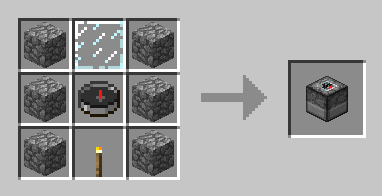

# Previous versions

Downloads for every version: [CurseForge](https://www.curseforge.com/minecraft/mc-mods/capsule/files) and [Modrinth](https://modrinth.com/mod/capsule/versions). The full list of changes is in the [changelog](https://github.com/Lythom/capsule/blob/master/CHANGELOG.md).

| Minecraft | Capsule | Loaders | Status |
|---|---|---|---|
| 1.21.1 | 9.0 | NeoForge, Fabric | current version |
| 1.20.4 | 8.0 | Forge | replaced by 1.21.1 |
| 1.20.1 | 8.0 | Forge | bug fixes |
| 1.19.2 | 7.0 | Forge | not updated anymore |
| 1.18.2 | 6.0 | Forge | bug fixes |
| 1.16.5 | 5.0 | Forge | bug fixes |
| 1.15.2 | 4.0 | Forge | not updated anymore |
| 1.12.2 | 3.x | Forge | not updated anymore |
| 1.11.2 | 1.4 | Forge | not updated anymore |
| 1.10.2 | 1.2, 1.3 | Forge | not updated anymore |
| 1.9.4, 1.9 | 1.1 | Forge | not updated anymore |
| 1.8.9 | 1.0 | Forge | not updated anymore |

The 9.0 bug fixes and the claim protection (Open Parties and Claims and Flan on 1.20.1 and 1.18.2, Flan on 1.16.5) reach the next Forge builds: 1.20.1 8.0.x, 1.18.2 6.0.x and 1.16.5 5.0.x. The 9.0 features (Loyalty, fire proof capsules, new tiers, translucent preview, capture animation, REI and EMI, Sponge v3 schematics) stay 1.21.1 only. See [Backports](Changelog-1.21.1-9.0#backports-to-forge-1201-1182-and-1165).

The pages of this wiki describe the latest version; features marked [since x.y] need at least that version.

## What differs in older versions

**1.20.4 and older (Capsule 8.0 and before)**
- Capsules come back with the Recall enchantment of the mod instead of vanilla Loyalty; `/capsule giveLinked` takes `withRecall` instead of `withLoyalty`.
- Capsules burn in fire and lava.
- Item data is plain NBT (`display.color` for the base color) instead of data components.
- Tag and recipe folders are plural: `data/capsule/tags/blocks`, `data/capsule/recipes`.

**Before 1.20.1**
- The overridable blocks are a config entry instead of the `capsule:overridable` tag.

**Before 1.16.5-5.0.70**
- The Capture Base always captures above it and is crafted with glass, a compass and a torch:

  

**1.12.2 and older**
- The configuration is `config/capsule.cfg` instead of `config/capsule-common.toml`, and there is no `capsule:excluded` tag: ask for a block to be excluded by default, or use `excludedBlocks` / `opExcludedBlocks`.
- Capsule templates are stored in `<world save>/structures/capsule` instead of `<world save>/capsules`.
- No `/capsule downloadTemplate` command, and the preview only shows wireframes.
- See the 1.12.2 showcases: [Builder's daydream update](Changelog-1.12.2-Builders-daydream-update) and [Bring your base! update](Changelog-1.12.2-Bring-your-base-update).
- The 1.10.2 major update showcase is on imgur: https://imgur.com/a/xCWCX

**1.9.4 and older**
- Not compatible with later versions: capsules made before 1.10.2 cannot be loaded (deploy everything before updating). The 1.9.4 user guide was hosted on the old Bitbucket wiki, which is no longer available.
